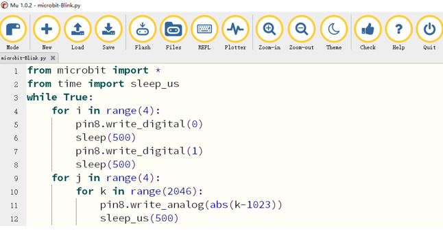

##############################################################################
Chapter GPIO
##############################################################################

Rover expands GPIO8 of micro:bit. You can use it to control some components, such as LED, neopixel, Buzzer,

Servo and so on.

Preparation
*********************************

1.  Insert micro:bit into Rover correctly.

2.  Install battery into Rover.

3.  Turn ON Rover power.

4.  Connect micro:bit and computer through USB cable.

Additional Components
===================================

.. image:: ../_static/imgs/1_GPIO/Chapter01_00.png
    :align: center

LED Blink & Breathing
****************************

For direct-insert packaged LED, the longer pin is positive and the shorter pin is negative. Connect the positive pole of LED to P8 and the negative pole to GND. 

.. image:: ../_static/imgs/1_GPIO/Chapter01_01.png
    :align: center

Code
==========================

Open the "microbit-Blink.py" with the Mu software. The path to the code is as follows:

+-------------+-----------------------------------------+-------------------+
| File type   | Path                                    | File name         |
+-------------+-----------------------------------------+-------------------+
| Python file | ../Extended Python Projects/ 01.1_Blink | microbit-Blink.py |
+-------------+-----------------------------------------+-------------------+

After the loading completes, the interface of Mu is as shown below:

Download the code into micro:bit. The LED will flash four times and then breathe four times, which repeats endlessly.

The following is the program code:

.. literalinclude:: ../../../freenove_Kit_extended/Extended_Python_Projects/01.1_Blink/microbit-Blink.py
    :linenos: 
    :language: python
    :lines: 1-12
    :dedent: