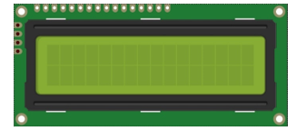
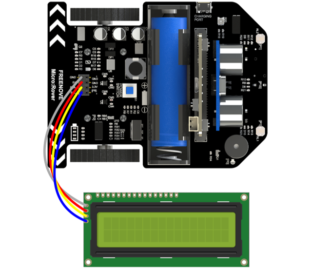
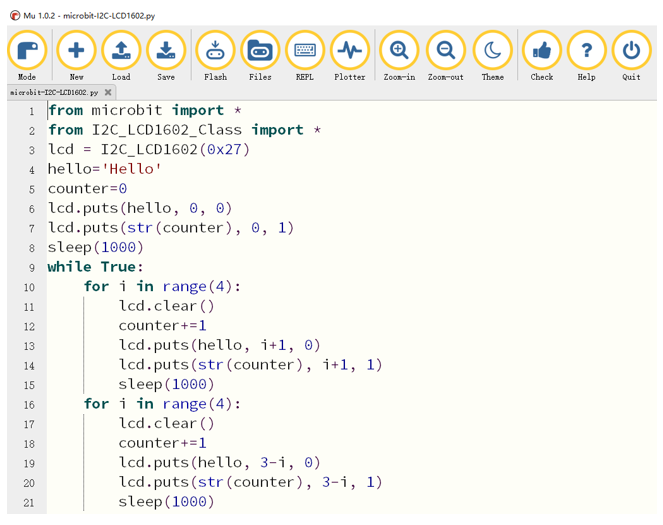

##############################################################################
Chapter I2C-LCD1602
##############################################################################

Rover expands I2C interface of micro:bit. You can use it to control any device with I2C interface, such as

I2CLCD1602, BMP180 (barometer) and so on

Preparation
**************************

1.  Insert micro:bit into Rover correctly.

2.  Install battery into Rover.

3.  Turn on Rover power.

4.  Connect micro:bit and computer through USB cable.

Additional Components
===========================

Display Character
*******************************

Connect I2CLCD1602 to I2C interface of Rover via jumper wires.

Code
=========================

Open the "microbit-I2C-LCD1602.py" with the Mu software. The path of the code is as follows:

+-------------+----------------------------------------------+-------------------------+
| File type   | Path                                         | File name               |
+-------------+----------------------------------------------+-------------------------+
| Python file | ../Extended Python Projects/02.1_I2C-LCD1602 | microbit-I2C-LCD1602.py |
+-------------+----------------------------------------------+-------------------------+

After the loading completes, the interface of Mu is as shown below:

Before downloading the program, import the "I2C_LCD1602_Class.py" file into micro:bit. The path of the code is as follows:

+-------------+---------------------------------------+----------------------+
| File type   | Path                                  | File name            |
+-------------+---------------------------------------+----------------------+
| Python file | ../Extended Python Projects/Libraries | I2C_LCD1602_Class.py |
+-------------+---------------------------------------+----------------------+

After the import is completed, click the "Flash" button to download the code to micro:bit and observe content displayed on the LCD screen. 

The following is the program code:

.. literalinclude:: ../../../freenove_Kit_extended/Extended_Python_Projects/02.1_I2C-LCD1602/microbit-I2C-LCD1602.py
    :linenos: 
    :language: python
    :lines: 1-21
    :dedent: