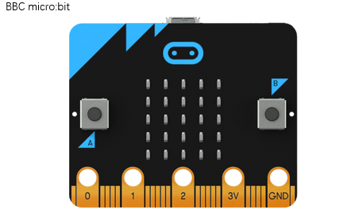
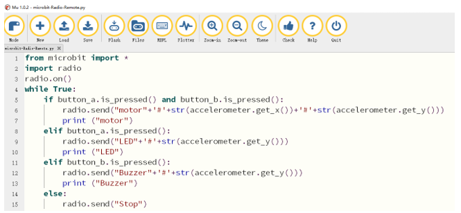
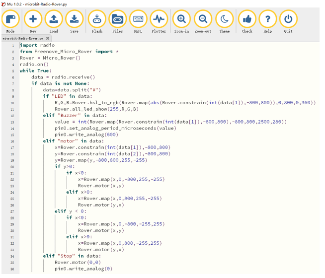

##############################################################################
Chapter Radio Control
##############################################################################

Different BBC micro:bit can communicate with each other directly through Radio. In this chapter, an additional

micro:bit will be used to control Rover.

Preparation
**************************

This project uses two micro:bit, one as remote control terminal and the other inserted into Rover. So there are two copies of the code for this project. We call remote end micro:bit(A) and the one on Rover micro:bit(B).

1.  Insert micro:bit into Rover correctly.

2.  Install battery into Rover.

3.  Turn ON Rover power.

4.  Connect micro:bit and computer through USB cable.

Additional Components
===========================

Radio Control
******************************

Code for remote
==============================

Connect micro:bit(A) with computer via USB.

Open the "microbit-Radio-Remote.py" with the Mu software. The path of the code is as follows:

+-------------+------------------------------------------------+--------------------------+
| File type   | Path                                           | File name                |
+-------------+------------------------------------------------+--------------------------+
| Python file | ../Extended Python Projects/ 03.1_RadioControl | microbit-Radio-Remote.py |
+-------------+------------------------------------------------+--------------------------+

After the loading completes, the interface of Mu is as shown below:

Download the code to micro:bit (A). It can be powered by USB or battery.

This code uses keys+gravity induction to control Rover.

Key A+gravity PITCH angle is used to set the color of RGB LED.

Key B+gravity PITCH angle is used to set the buzzer frequency.

Key A+B+gravity PITCH and ROLL direction angle is used to control movement of Rover.

The following is the program code:

.. literalinclude:: ../../../freenove_Kit_extended/Extended_Python_Projects/03.1_RadioControl/microbit-Radio-Remote.py
    :linenos: 
    :language: python
    :lines: 1-15
    :dedent:

Code for Rover
===============================

Open the "microbit-Radio-Rover.py" with the Mu software. The path of the code is as follows:

+-------------+------------------------------------------------+-------------------------+
| File type   | Path                                           | File name               |
+-------------+------------------------------------------------+-------------------------+
| Python file | ../Extended Python Projects/ 03.1_RadioControl | microbit-Radio-Rover.py |
+-------------+------------------------------------------------+-------------------------+

After the loading completes, the interface of Mu is as shown below:

Import “Freenove_Micro_Rover_2.py” into micro:bit. The path of the code is as follows:

+-------------+-------------------------------------------+---------------------------+
| File type   | Path                                      | File name                 |
+-------------+-------------------------------------------+---------------------------+
| Python file | .. / Extended Python Projects / Libraries | Freenove_Micro_Rover_2.py |
+-------------+-------------------------------------------+---------------------------+

After the import is completed, click the "Flash" button to download the code to micro:bit, and you can use micro:bit(A) to control Rover.

.. note:: 
    
    The Freenove_Micro_Rover_2.py file does not contain the get_distance() function associated with the ultrasonic module. To use the ultrasonic module, import the Freenove_Micro_Rover.py file 

The following is the program code:

.. literalinclude:: ../../../freenove_Kit_extended/Extended_Python_Projects/03.1_RadioControl/microbit-Radio-Rover.py
    :linenos: 
    :language: python
    :lines: 1-36
    :dedent: