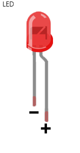
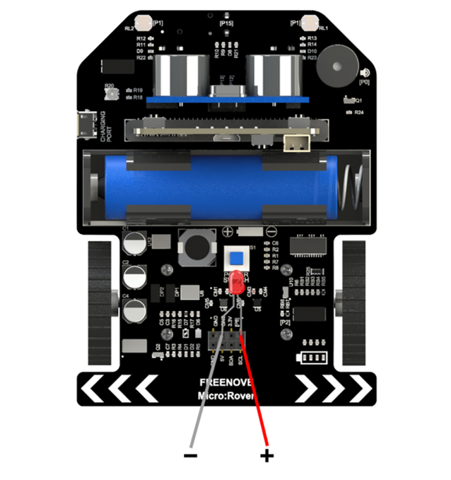
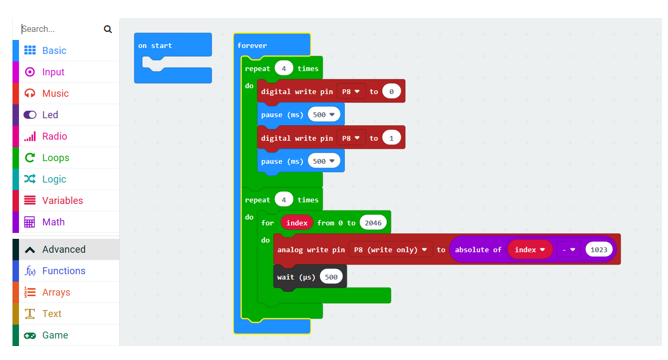

##############################################################################
Chapter GPIO
##############################################################################

Rover expands GPIO8 of micro:bit. You can use it to control some components, such as LED, neopixel, Buzzer, Servo and so on.

Preparation
****************************

1.	Insert micro:bit into Rover correctly.

2.	Install battery into Rover.

3.	Turn on Rover power.

4.	Connect micro:bit and computer through USB cable.

Open web version of makecode or windows 10 app version of makecode.

Components
============================

LED Blink & Breathing
****************************

For direct-insert packaged LED, the longer pin is positive and the shorter pin is negative. Connect the positive pole of LED to P8 and the negative pole to GND. 

Code
=======================

Load code according to the table below:

+-----------+----------------------------------+--------------------+
| File type | Path                             | File name          |
+-----------+----------------------------------+--------------------+
| Hex file  | ../Expanding Projects/01.1_Blink | microbit-Blink.hex |
+-----------+----------------------------------+--------------------+

Download the code to micro:bit. The LED connected to the Rover expansion starts to blink four times, then breathes four times, and then circulates in turn.