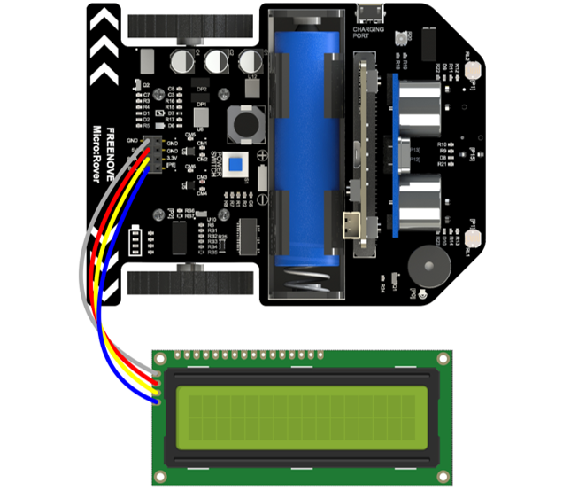

##############################################################################
Chapter I2C-LCD1602
##############################################################################

Rover expands I2C interface of micro:bit. You can use it to control any device with I2C interface, such as I2CLCD1602, BMP180 (barometer) and so on.

Preparation
********************************

1.	Insert micro:bit into Rover correctly.

2.	Install battery into Rover. 

3.	Turn on Rover power.

4.	Connect micro:bit and computer through USB cable.

Open web version of makecode or windows 10 app version of makecode.

**If you choose to load the project by importing Hex file, there is no need to add the Rover extension manually.**

If you choose to drag code manually, you first need to add I2C_LCD160 extension library.

Its GitHub address is below:

https://github.com/makecode-extensions/i2cLCD1602 

Components
=====================

.. image:: ../_static/imgs/2_I2C-LCD1602/Chapter02_00.png
    :align: center

Show Character
***********************

Connect I2CLCD1602 to I2C interface of Rover via jumper wires.

Code
========================

Load code according to the table below:

+-----------+----------------------------------------+--------------------------+
| File type | Path                                   | File name                |
+-----------+----------------------------------------+--------------------------+
| Hex file  | ../Expanding Projects/02.1_I2C-LCD1602 | microbit-I2C-LCD1602.hex |
+-----------+----------------------------------------+--------------------------+

Download the code to micro:bit. Observe the contents showed on the LCD.