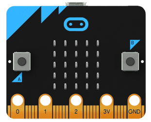
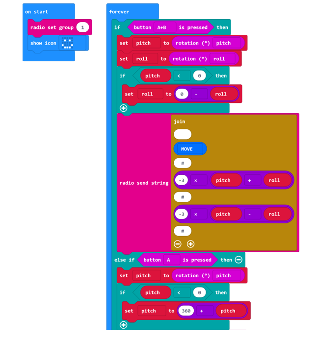
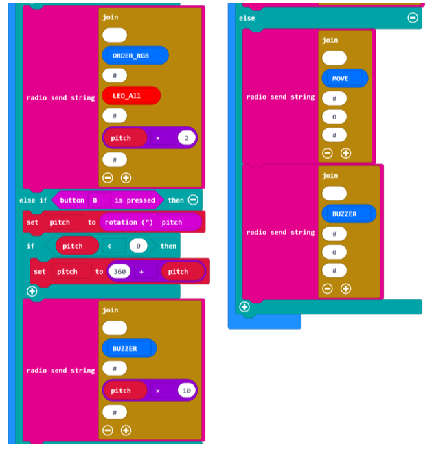
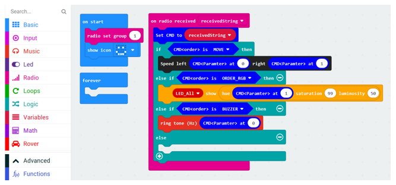

##############################################################################
Chapter Radio Control
##############################################################################

Different BBC micro:bit can communicate with each other directly through Radio. In this chapter, an additional micro:bit will be used to control Rover.

Preparation
*****************************

This project uses two micro:bit, one as remote control terminal and another on Rover. So there are two copies of the code for this project. We call remote end micro:bit(A) and the one on Rover micro:bit(B).

1.	Insert micro:bit into Rover correctly.

2.	Install battery into Rover. 

3.	Turn on Rover power.

Open web version of makecode or windows 10 app version of makecode.

If you choose to load the project by importing Hex file, there is no need to add the Rover extension manually.

If you choose to drag code manually, you first need to add Rover extensions.

Components
===========================

Radio Control
***************************

Code for remote
==========================

Connect micro:bit(A) with computer via USB.

Load code according to the table below:

+-----------+-----------------------------------------+---------------------------+
| File type | Path                                    | File name                 |
+-----------+-----------------------------------------+---------------------------+
| Hex file  | ../Expanding Projects/03.1_RadioControl | microbit-Radio-Remote.hex |
+-----------+-----------------------------------------+---------------------------+

Download the code to micro:bit (A). It can be powered by USB or battery.

This code uses keys+gravity induction to control Rover.

Key A+gravity PITCH angle is used to set the color of RGB LED.

Key B+gravity PITCH angle is used to set the buzzer frequency.

Key A+B+gravity PITCH and ROLL direction angle is used to control movement of Rover.

Code for Rover 
========================

Connect micro:bit (B) to computer via USB cable.

Load code according to the table below:

+-----------+-----------------------------------------+--------------------------+
| File type | Path                                    | File name                |
+-----------+-----------------------------------------+--------------------------+
| Hex file  | ../Expanding Projects/03.1_RadioControl | microbit-Radio-Rover.hex |
+-----------+-----------------------------------------+--------------------------+

Download the code to micro:bit(B).

Then you can use micro:bit(A) to control Rover.

