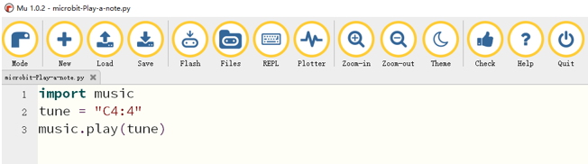
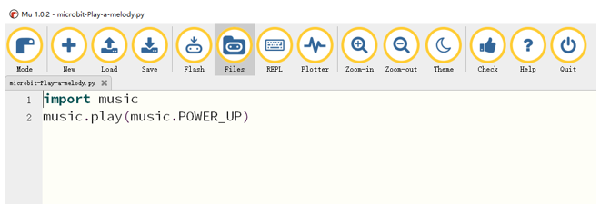
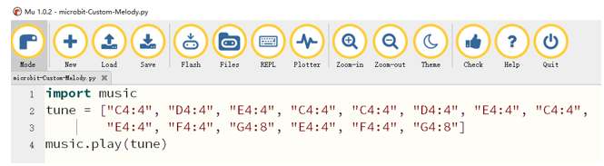

##############################################################################
Chapter Music
##############################################################################

You can use the buzzer on the car to play music.

Preparation
***********************

1.	Insert micro:bit into Rover correctly.

2.	Install battery into Rover. 

3.	Turn ON Rover power.

4.	Connect micro:bit and computer through USB cable.

Play a note
****************************

Let the car play a note.

Code
============================
Open the "microbit-Play-a-note.py" with the Mu software. The path to the code is as follows: ( :ref:`How to load the project code? <load>` )

+-------------+------------------------------------+-------------------------+
| File type   | Path                               | File name               |
+-------------+------------------------------------+-------------------------+
| Python file | ../PythonProjects/01.1_Play-a-note | microbit-Play-a-note.py |
+-------------+------------------------------------+-------------------------+

After the loading is completed, the interface of Mu is as shown below:

Download the code to micro:bit and the car will play a note. "C4:4" means that the note is C4 and the beat is 4.

The following is the program code:

.. literalinclude:: ../../../freenove_Kit/PythonProjects/01.1_Play-a-note/microbit-Play-a-note.py
    :linenos: 
    :language: python
    :lines: 1-3
    :dedent:

Import the music module, which contains functions that control the sound and make sounds.

.. literalinclude:: ../../../freenove_Kit/PythonProjects/01.1_Play-a-note/microbit-Play-a-note.py
    :linenos: 
    :language: python
    :lines: 1-1
    :dedent:

Create a variable tune to store notes.

.. literalinclude:: ../../../freenove_Kit/PythonProjects/01.1_Play-a-note/microbit-Play-a-note.py
    :linenos: 
    :language: python
    :lines: 2-2
    :dedent:

Call the play() function to play the notes stored in the variable tune.

.. literalinclude:: ../../../freenove_Kit/PythonProjects/01.1_Play-a-note/microbit-Play-a-note.py
    :linenos: 
    :language: python
    :lines: 3-3
    :dedent:

Reference
----------------------------

.. py:function:: music.play()	
    
    It is used to play music. MicroPython has quite a lot of built-in melodies. 
    
    For more information, please refer to:
    
    https://microbit-micropython.readthedocs.io/en/latest/tutorials/music.html

Play a melody
****************************

Let the car play a melody.

Code
=============================

Open the "microbit-Play-a-melody.py" with the Mu software. The path of the code is as follows: ( :ref:`How to load the project code? <load>` )

+-------------+--------------------------------------+---------------------------+
| File type   | Path                                 | File name                 |
+-------------+--------------------------------------+---------------------------+
| Python file | ../PythonProjects/01.2_Play-a-melody | microbit-Play-a-melody.py |
+-------------+--------------------------------------+---------------------------+

After the loading is completed, the interface of Mu is as shown below:

Download the code to micro:bit and the car will play a melody called "POWER_UP".

The following is the program code:

.. literalinclude:: ../../../freenove_Kit/PythonProjects/01.2_Play-a-melody/microbit-Play-a-melody.py
    :linenos: 
    :language: python
    :lines: 1-2
    :dedent:

Import music module.

.. literalinclude:: ../../../freenove_Kit/PythonProjects/01.2_Play-a-melody/microbit-Play-a-melody.py
    :linenos: 
    :language: python
    :lines: 1-1
    :dedent:

Call the play() function to play a melody called "POWER_UP"

.. literalinclude:: ../../../freenove_Kit/PythonProjects/01.2_Play-a-melody/microbit-Play-a-melody.py
    :linenos: 
    :language: python
    :lines: 2-2
    :dedent:

Play custom melody
***********************************

Let the car play a custom melody.

Code
=======================

Open the "microbit-Custom-Melody.py" with the Mu software. The path of the code is as follows: ( :ref:`How to load the project code? <load>` )

+-------------+----------------------------------------+---------------------------+
| File type   | Path                                   | File name                 |
+-------------+----------------------------------------+---------------------------+
| Python file | ../PythonProjects / 01.3_Custom-Melody | microbit-Custom-Melody.py |
+-------------+----------------------------------------+---------------------------+

After the loading is completed, the interface of Mu is as shown below:

Download the code to micro:bit and the car will play a custom melody.

The following is the program code:

.. literalinclude:: ../../../freenove_Kit/PythonProjects/01.3_Custom-Melody/microbit-Custom-Melody.py
    :linenos: 
    :language: python
    :lines: 1-4
    :dedent:

Import the music module, which contains functions that control the sound and make sounds.

.. literalinclude:: ../../../freenove_Kit/PythonProjects/01.3_Custom-Melody/microbit-Custom-Melody.py
    :linenos: 
    :language: python
    :lines: 1-1
    :dedent:

Create a variable tune to store notes.

.. literalinclude:: ../../../freenove_Kit/PythonProjects/01.3_Custom-Melody/microbit-Custom-Melody.py
    :linenos: 
    :language: python
    :lines: 2-3
    :dedent:

Call the play() function to play the notes stored in the variable tune.

.. literalinclude:: ../../../freenove_Kit/PythonProjects/01.3_Custom-Melody/microbit-Custom-Melody.py
    :linenos: 
    :language: python
    :lines: 4-4
    :dedent: