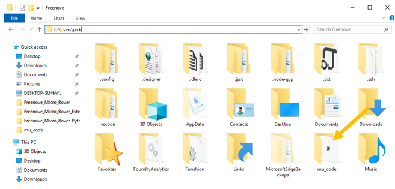
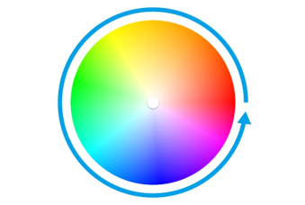

##############################################################################
Chapter RGB LED
##############################################################################

There are four sets of RGBLEDs integrated on Rover, each has three RGBLEDs and can be controlled independently. Now create your own RGB light.

Preparation
************************

1.	Insert micro:bit into Rover correctly.

2.	Install battery into Rover. 

3.	Turn ON Rover power.

4.	Connect micro:bit and computer through USB cable.

Emitting one color of light
********************************

Let all the LEDs on the car display the same color with same brightness.

Code
==================

Open the "microbit-LED-OneColor.py" with the Mu software. The path of the code is as follows: ( :ref:`How to load the project code? <load>` )

+-------------+---------------------------------------+--------------------------+
| File type   | Path                                  | File name                |
+-------------+---------------------------------------+--------------------------+
| Python file | ../PythonProjects / 02.1_LED-OneColor | microbit-LED-OneColor.py |
+-------------+---------------------------------------+--------------------------+

After the loading is completed, the interface of Mu is as shown below:

Don't rush to click on "Flash", because you still need  some extra work: import the "Freenove_Micro_Rover.py" file into micro:bit. This file contains methods to control Rover, which were integrated into a class "Micro_Rover", making it easier for you to control Rover through Python code. This is similar to the extension in the block code. 

.. _importpy:

Import the "Freenove_Micro_Rover.py" file.
----------------------------------------------------

The default directory for Mu to save files is "mu_code", which is in the root of your user directory.

Reference: https://codewith.mu/en/tutorials/1.0/files

For example, in the windows system, assuming your system is installed on the C drive, the user name is "jack", then the path of the "mu_code" directory is "C:\Users\jack\mu_code".

On Linux systems, the path to the "mu_code" directory is "~/home/mu_code"

Enter the "mu_code" folder.

Copy the "Freenove_Micro_Rover.py" file to the "mu_code" folder. The path of the code is as follows:

+-------------+-------------------------------+-------------------------+
| File type   | Path                          | File name               |
+-------------+-------------------------------+-------------------------+
| Python file | ../PythonProjects / Libraries | Freenove_Micro_Rover.py |
+-------------+-------------------------------+-------------------------+

The copy is successful as shown below: 

Open the Mu software and connect micro:bit to the computer. Click on "Files". Import"Freenove_Micro_Rover.py" into micro:bit. 

After a few seconds, the import is completed.

After the import is completed, click the "Flash" button to download the code to micro:bit. All LEDs on the car emit red light. 

After importing successfully, you will see it on left.

.. note:: 
    
    :red:`when you upload other file into micro:bit, the content will be covered. You need to import it next time you use it.`

The following is the program code:

.. literalinclude:: ../../../freenove_Kit/PythonProjects/02.1_LED-OneColor/microbit-LED-OneColor.py
    :linenos: 
    :language: python
    :lines: 1-3
    :dedent:

Import the Freenove_Micro_Rover module, which contains functions that control LEDs, drive motors, etc.

.. literalinclude:: ../../../freenove_Kit/PythonProjects/02.1_LED-OneColor/microbit-LED-OneColor.py
    :linenos: 
    :language: python
    :lines: 1-1
    :dedent:

Create an object of the Micro_Rover class in the Freenove_Micro_Rover module.

.. literalinclude:: ../../../freenove_Kit/PythonProjects/02.1_LED-OneColor/microbit-LED-OneColor.py
    :linenos: 
    :language: python
    :lines: 2-2
    :dedent:

Call the all_led_show() function in the Micro_Rover class to turn ON all the LEDs on the car.

.. literalinclude:: ../../../freenove_Kit/PythonProjects/02.1_LED-OneColor/microbit-LED-OneColor.py
    :linenos: 
    :language: python
    :lines: 3-3
    :dedent:

Reference
--------------------

.. py:function:: all_led_show(Brightness, R, G, B)	

    **Description:**

    Set all RGB LEDs on the Rover to the same brightness and color. This function belongs to the Micro_Rover class in the Freenove_Micro_Rover module. 

    **Parameter:**

    Brightness: Specifies the brightness of the LED, the value ranges from 0-255.

    R, G, B: Specifies the color value, the value ranges from 0-255.

    **Return:**

    Nothing

    **Example:**

    All_led_show(255,0,255,0), sets all RGB LEDs to green (0, 255, 0) with maximum brightness (255).

Emitting different colors of light
****************************************

Let the LEDs on the car display different colors.

Code
======================

Open the "microbit-LED-DifferentColors.py" with the Mu software. The path of the code is as follows:

+-------------+----------------------------------------------+---------------------------------+
| File type   | Path                                         | File name                       |
+-------------+----------------------------------------------+---------------------------------+
| Python file | ../PythonProjects / 02.2_LED-DifferentColors | microbit-LED-DifferentColors.py |
+-------------+----------------------------------------------+---------------------------------+

After the loading completes, the interface of Mu is as shown below:

Import the "Freenove_Micro_Rover.py" file into micro:bit, ( :ref:`How to import files? <importpy>` ), then download the code to micro:bit. LED1 on the car emits red, LED2 emits green, LED3 emits blue, and LED4 emits yellow. 

The following is the program code:

.. literalinclude:: ../../../freenove_Kit/PythonProjects/02.2_LED-DifferentColors/microbit-LED-DifferentColors.py
    :linenos: 
    :language: python
    :lines: 1-6
    :dedent:

Import the Freenove_Micro_Rover module.

.. literalinclude:: ../../../freenove_Kit/PythonProjects/02.2_LED-DifferentColors/microbit-LED-DifferentColors.py
    :linenos: 
    :language: python
    :lines: 1-1
    :dedent:

Create an object of the Micro_Rover class in the Freenove_Micro_Rover module.

.. literalinclude:: ../../../freenove_Kit/PythonProjects/02.2_LED-DifferentColors/microbit-LED-DifferentColors.py
    :linenos: 
    :language: python
    :lines: 2-2
    :dedent:

Call the led_show () function in the Micro_Rover class to illuminate the LED on the car. The brightness is the maximum brightness (255), LED1 emits red (255,0,0), LED2 emits green (0,255,0), LED3 emits blue (0,0,255), and LED4 emits yellow (255,255,0). 

.. literalinclude:: ../../../freenove_Kit/PythonProjects/02.2_LED-DifferentColors/microbit-LED-DifferentColors.py
    :linenos: 
    :language: python
    :lines: 3-6
    :dedent:

Reference
---------------------------

.. py:function:: led_show( Index, Brightness, R,G ,B )	
    
    **Description:**

    Set the brightness and color of selected RGBLED.
    
    This function belongs to the Micro_Rover class in the Freenove_Micro_Rover module. 

    **Parameter:**

    Index: Specify the LED sequence number. LED1: 0x01, LED2: 0x02, LED3: 0x04, LED4: 0x08.
    
    Brightness: Specifies the brightness of the LED, the value range is 0-255.
    
    R, G, B: Specify the color value, the value range is 0-255.

    **Return:**
    
    Nothing

    **Example:**

    Led_show (0x01, 255, 0, 255, 0), set LED1 with the sequence number 0x01 to light green (0, 255, 0) with maximum brightness (255).

Emitting random color of light
*****************************************

Let the LED on the car show a random color.

Code
======================

Open the "microbit-LED-DifferentColors.py" with the Mu software. The path of the code is as follows:

+-------------+----------------------------------------------+---------------------------------+
|  File type  |                     Path                     |            File name            |
+=============+==============================================+=================================+
| Python file | ../PythonProjects / 02.2_LED-DifferentColors | microbit-LED-DifferentColors.py |
+-------------+----------------------------------------------+---------------------------------+

After the loading completes, the interface of Mu is as shown below:

Import the "Freenove_Micro_Rover.py" file into micro:bit ( :ref:`How to import files? <importpy>` ) and download the code into micro:bit. The LEDs on the car will show random colors. 

The following is the program code:

.. literalinclude:: ../../../freenove_Kit/PythonProjects/02.3_LED-RandomColors/microbit-LED-RandomColors.py
    :linenos: 
    :language: python
    :lines: 1-9
    :dedent:

Import the random module. MicroPython comes with a random module to make it easy to introduce chance and a little chaos into your code.

.. literalinclude:: ../../../freenove_Kit/PythonProjects/02.3_LED-RandomColors/microbit-LED-RandomColors.py
    :linenos: 
    :language: python
    :lines: 1-1
    :dedent:

Import the Freenove_Micro_Rover module.

.. literalinclude:: ../../../freenove_Kit/PythonProjects/02.3_LED-RandomColors/microbit-LED-RandomColors.py
    :linenos: 
    :language: python
    :lines: 2-2
    :dedent:

Create an object of the Micro_Rover class in the Freenove_Micro_Rover module.

.. literalinclude:: ../../../freenove_Kit/PythonProjects/02.3_LED-RandomColors/microbit-LED-RandomColors.py
    :linenos: 
    :language: python
    :lines: 3-3
    :dedent:

This is a permanent loop that will cause the micro:bit to execute the code in this loop forever.

.. literalinclude:: ../../../freenove_Kit/PythonProjects/02.3_LED-RandomColors/microbit-LED-RandomColors.py
    :linenos: 
    :language: python
    :lines: 4-4
    :dedent:

Call the randint() function in the random module to generate a random number within 0-255. Assign the obtained random number to the R, G, and B variables. Then call the all_led_show() function to let the LED show the color corresponding to the RGB value. 

.. literalinclude:: ../../../freenove_Kit/PythonProjects/02.3_LED-RandomColors/microbit-LED-RandomColors.py
    :linenos: 
    :language: python
    :lines: 5-8
    :dedent:

The delay is 0.2S, so the color is changed every 0.2S.

.. literalinclude:: ../../../freenove_Kit/PythonProjects/02.3_LED-RandomColors/microbit-LED-RandomColors.py
    :linenos: 
    :language: python
    :lines: 9-9
    :dedent:

Reference
----------------------

.. py:function:: randint(a,b)	
    
    Return a random integer N such that a <= N <= b. Alias for randrange(a, b+1).
    
    Example: randint(0,100), which returns an integer in the range 0-100.
    
    For more information: https://microbit-micropython.readthedocs.io/en/latest/random.html

.. py:function:: sleep(ms)	

    sleep for the given number of milliseconds.
    
    For more details about sleep function,
    
    Please refer to: https://microbit-micropython.readthedocs.io/en/latest/utime.html

Emittinng soft colors
*********************************

Let the LEDs on the car emit soft colors.

Code
================================

Open the "microbit-LED-RandomColors.py" with the Mu software. The path of the code is as follows:

+-------------+-------------------------------------------+------------------------------+
| File type   | Path                                      | File name                    |
+-------------+-------------------------------------------+------------------------------+
| Python file | ../PythonProjects / 02.3_LED-RandomColors | microbit-LED-RandomColors.py |
+-------------+-------------------------------------------+------------------------------+

After the loading completes, the interface of Mu is as shown below:

Import the "Freenove_Micro_Rover.py" file into micro:bit( :ref:`How to import files? <importpy>` ), then download the code to micro:bit, and LEDs emit soft colors on the car. 

In this code, the HSL color model is used. The hue range is 0-360, and when the hue is different, the colors will be different, as shown in the following figure:

The following is the program code:

.. literalinclude:: ../../../freenove_Kit/PythonProjects/02.4_LED-SoftColors/microbit-LED-SoftColors.py
    :linenos: 
    :language: python
    :lines: 1-5
    :dedent:

Import the Freenove_Micro_Rover module.

.. literalinclude:: ../../../freenove_Kit/PythonProjects/02.4_LED-SoftColors/microbit-LED-SoftColors.py
    :linenos: 
    :language: python
    :lines: 1-1
    :dedent:

Create an object of the Micro_Rover class in the Freenove_Micro_Rover module.

.. literalinclude:: ../../../freenove_Kit/PythonProjects/02.4_LED-SoftColors/microbit-LED-SoftColors.py
    :linenos: 
    :language: python
    :lines: 2-2
    :dedent:

Create a for loop that loops 360 times in the while loop, simulating the hue of 0-360. Call the hsl_to_rgb () function to convert the color value of the corresponding hue to RGB values. Then turn ONthe LED and change the color every 10ms. 

.. literalinclude:: ../../../freenove_Kit/PythonProjects/02.4_LED-SoftColors/microbit-LED-SoftColors.py
    :linenos: 
    :language: python
    :lines: 2-2
    :dedent:

Create a for loop that loops 360 times in the while loop, simulating the hue of 0-360. Call the hsl_to_rgb () function to convert the color value of the corresponding hue to RGB values. Then turn ONthe LED and change the color every 10ms. 

.. literalinclude:: ../../../freenove_Kit/PythonProjects/02.4_LED-SoftColors/microbit-LED-SoftColors.py
    :linenos: 
    :language: python
    :lines: 3-7
    :dedent:

Reference
----------------------------

.. py:function:: hsl_to_rgb(h)	
   
    **Description:**
   
    Convert the HSL color model to an RGB color model. This function belongs to the Micro_Rover class in the Freenove_Micro_Rover module. 

    **Parameter:**
   
    h: Hue value of the HSL color model, ranging from 0-360.

    **Return:**

    R, G, B: Three values representing the color values of the three channels R, G, and B.

    **Example:**

    hsl_to_rgb(0). The return color is red, and the RGB value of the hue 0 is (255, 0, 0).