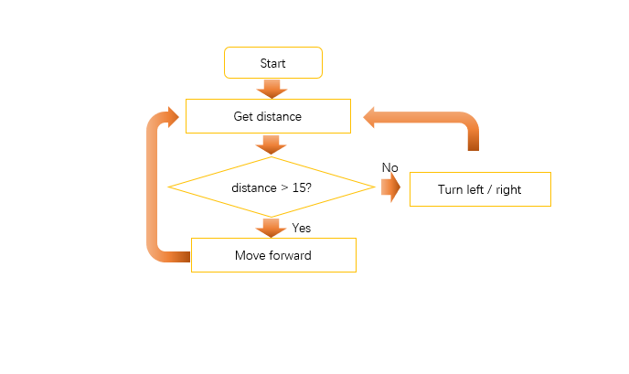

##############################################################################
Chapter Ultrasonic Ranging
##############################################################################

The ultrasonic module on Rover can measure the distance between Rover and the obstacle in front of it. Therefore, take advantage of this characteristic to make Rover avoid obstacle  When Rover is close to the obstacle in the front, let it turn to avoid the obstacle.

Preparation
*****************************

1.	Insert micro:bit into Rover correctly.

2.	Install battery into Rover. 

3.	Turn ON Rover power.

4.	Connect micro:bit and computer through USB cable.

Obtain value of ultrasonic ranging

Obtain the distance measurement value of the ultrasonic module on the car, and then display it with LED matrix on the micro:bit.

Code
===============================

Open the "microbit-Rangingr.py" with the Mu software. The path of the code is as follows: ( :ref:`How to load the project code? <load>` )

+-------------+----------------------------------+---------------------+
| File type   | Path                             | File name           |
+-------------+----------------------------------+---------------------+
| Python file | ../PythonProjects / 03.1_Ranging | microbit-Ranging.py |
+-------------+----------------------------------+---------------------+

After the loading completes, the interface of Mu is as shown below:

Import the “Freenove_Micro_Rover.py” file into micro:bit ( :ref:`How to import files? <importpy>` ) and download the code into micro:bit. The LED matrix on the micro:bit will display the distance value of the ultrasonic module. 

The following is the program code:

.. literalinclude:: ../../../freenove_Kit/PythonProjects/03.1_Ranging/microbit-Ranging.py
    :linenos: 
    :language: python
    :lines: 1-5
    :dedent:

Import the Freenove_Micro_Rover module, which contains functions that control LEDs, drive motors,etc.

.. literalinclude:: ../../../freenove_Kit/PythonProjects/03.1_Ranging/microbit-Ranging.py
    :linenos: 
    :language: python
    :lines: 1-1
    :dedent:

Create an object of the Micro_Rover class in the Freenove_Micro_Rover module.

.. literalinclude:: ../../../freenove_Kit/PythonProjects/03.1_Ranging/microbit-Ranging.py
    :linenos: 
    :language: python
    :lines: 2-2
    :dedent:

Call the custom get_distance () function in the while loop to get the value of ultrasonic module. Finally, call the display.scroll() function to display the value on the LED matrix. 

.. literalinclude:: ../../../freenove_Kit/PythonProjects/03.1_Ranging/microbit-Ranging.py
    :linenos: 
    :language: python
    :lines: 3-5
    :dedent:

Reference
----------------------

.. py:function:: get_distance()	
    
    Obtain the value of the ultrasonic module and return it with integer in CM.

.. py:function:: display.scroll()	

    Scrolls value horizontally on the display. If value is an integer or float it is first converted to a string using str().

    For more information, please refer to: https://microbit-micropython.readthedocs.io/en/latest/utime.html

Rover-Obstacle avoidance mode -1
*******************************************

In this project, we will realize the obstacle avoidance mode of Rover.

Flow chart
================================

The program code is written according to flow chart, as shown below.

Code
=========================

Open the "microbit-Obstacle-Avoidance-1.py" with the Mu software. The path of the code is as follows:

+-------------+----------------------------------------------+----------------------------------+
| File type   | Path                                         | File name                        |
+-------------+----------------------------------------------+----------------------------------+
| Python file | ../PythonProjects /03.2_Obstacle-Avoidance-1 | microbit-Obstacle-Avoidance-1.py |
+-------------+----------------------------------------------+----------------------------------+

After the loading completes, the interface of Mu is as shown below:

Import the "Freenove_Micro_Rover.py" file into micro:bit, then download the code into micro:bit and observe the movement of the car.

The following is the program code:

.. literalinclude:: ../../../freenove_Kit/PythonProjects/03.2_Obstacle-Avoidance-1/microbit-Obstacle-Avoidance-1.py
    :linenos: 
    :language: python
    :lines: 1-8
    :dedent:

Import the Freenove_Micro_Rover module.

.. literalinclude:: ../../../freenove_Kit/PythonProjects/03.2_Obstacle-Avoidance-1/microbit-Obstacle-Avoidance-1.py
    :linenos: 
    :language: python
    :lines: 1-1
    :dedent:

Create an object of the Micro_Rover class in the Freenove_Micro_Rover module.

.. literalinclude:: ../../../freenove_Kit/PythonProjects/03.2_Obstacle-Avoidance-1/microbit-Obstacle-Avoidance-1.py
    :linenos: 
    :language: python
    :lines: 2-2
    :dedent:

Call the custom get_distance () function in the while loop to get the value of the ultrasonic module. The car will make movements according to the distance value received.  If the distance is greater than 15 cm, the car advances. If the distance is less than 15cm, the car will turn left. 

.. literalinclude:: ../../../freenove_Kit/PythonProjects/03.2_Obstacle-Avoidance-1/microbit-Obstacle-Avoidance-1.py
    :linenos: 
    :language: python
    :lines: 3-8
    :dedent:

Reference
-------------------------------

.. py:function:: motor(left,right)	
    
    **Description:**
    
    Set the speed and direction of the two motors on the Rover. This function belongs to the Micro_Rover class in the Freenove_Micro_Rover module. 
 
    **Parameter:**
    
    Left: Refers to the speed and direction of the motor on the left side, positive values indicate forward and negative values indicate backward. The absolute value of the value indicates the speed. Value range: -255~255. 
    
    Right: Refers to the speed and direction of the motor on the right side, positive values indicates forward, negative values indicate backwards, and the absolute value of the value indicates the speed. Value range: -255~255. 

    **Return:**
    
    None

    **Example:**
    
    Motor (-255, -255), Rover will move back at maximum speed.

Rover-Obstacle avoidance mode -2
****************************************

In this project, we will combine RGBLED and LED matrix to provide some auxiliary instructions for obstacle avoidance mode.

Code
=====================

Open the "microbit-Obstacle-Avoidance-2.py" with the Mu software. The path of the code is as follows:

+-------------+-----------------------------------------------+----------------------------------+
| File type   | Path                                          | File name                        |
+-------------+-----------------------------------------------+----------------------------------+
| Python file | ../PythonProjects / 03.3_Obstacle-Avoidance-2 | microbit-Obstacle-Avoidance-2.py |
+-------------+-----------------------------------------------+----------------------------------+

After the loading completes, the interface of Mu is as shown below:

Import the "Freenove_Micro_Rover.py" file into micro:bit and download the code into micro:bit, and then observe the movement of the Rover. When the measured distance is different, the LEDs display different colors. 

The following is the program code:

.. literalinclude:: ../../../freenove_Kit/PythonProjects/03.3_Obstacle-Avoidance-2/microbit-Obstacle-Avoidance-2.py
    :linenos: 
    :language: python
    :lines: 1-10
    :dedent:

Import the Freenove_Micro_Rover module.

.. literalinclude:: ../../../freenove_Kit/PythonProjects/03.3_Obstacle-Avoidance-2/microbit-Obstacle-Avoidance-2.py
    :linenos: 
    :language: python
    :lines: 1-1
    :dedent:

Create an object of the Micro_Rover class in the Freenove_Micro_Rover module.

.. literalinclude:: ../../../freenove_Kit/PythonProjects/03.3_Obstacle-Avoidance-2/microbit-Obstacle-Avoidance-2.py
    :linenos: 
    :language: python
    :lines: 2-2
    :dedent:

Call the custom get_distance () function in the while loop to get the value of the ultrasonic module. Pass this value into the hsl_to_rgb() function, returning an RGB value to light up LED. Finally, the car will make movements according to the distance value received. If the distance is greater than 15 cm, the car moves forward. If the distance is less than 15cm, the car will turn left. 

.. literalinclude:: ../../../freenove_Kit/PythonProjects/03.3_Obstacle-Avoidance-2/microbit-Obstacle-Avoidance-2.py
    :linenos: 
    :language: python
    :lines: 3-10
    :dedent:

Reference
-----------------------

.. py:function:: constrain (value,low,high)	

    **Description:**

    Constrain the value between the values “low” and “high” and return the value. This function belongs to the Micro_Rover class in the Freenove_Micro_Rover module. 

    **Parameter:**

    Value: the value to be constrained
    
    low: the minimum value of the constraint interval
    
    high: the maximum value of the constraint interval

    **Return:**
    value after constrained

    **Example:**

    Constrain(-1,0,10), the return value is 0.
    
    Constrain(5,0,10), the return value is 5.