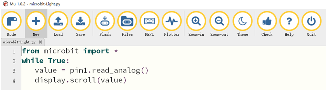
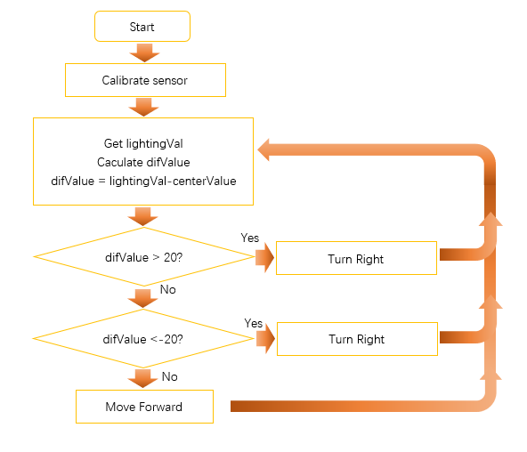
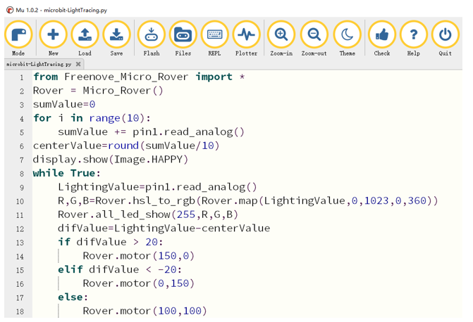

##############################################################################
Chapter Light tracing 
##############################################################################

There are two light intensity sensors on Rover, so we can learn which sensor receives more intensive light based on the difference between the values of the two sensors. In this way, Rover can achieve the function of tracking or avoiding light.

Preparation
*********************************

1.	Insert micro:bit into Rover correctly.

2.	Install battery into Rover. 

3.	Turn ON Rover power.

4.	Connect micro:bit and computer through USB cable.

Get value of light intensity sensor
*******************************************

Get the value of the onboard light intensity sensor and display it on the LED matrix of the micro:bit.

Code
=========================

Open the "microbit-Light.py" with the Mu software. The path of the code is as follows: ( :ref:`How to load the project code? <load>` )

+-------------+--------------------------------+-------------------+
| File type   | Path                           | File name         |
+-------------+--------------------------------+-------------------+
| Python file | ../PythonProjects / 04.1_Light | microbit-Light.py |
+-------------+--------------------------------+-------------------+

After the loading completes, the interface of Mu is as shown below:

Download the code into micro:bit. Illuminate the light intensity sensor with a light source or cover it with your hand to observe the change of value on LED matrix of the micro:bit 

The following is the program code:

.. literalinclude:: ../../../freenove_Kit/PythonProjects/04.1_Light/microbit-Light.py
    :linenos: 
    :language: python
    :lines: 1-4
    :dedent:

Import everything in the microbit module, including functions, classes, variables, and so on. You can also use “import microbit” directly. If you do this, you need to add "microbit." when you call the contents of this module in the program. 

.. literalinclude:: ../../../freenove_Kit/PythonProjects/04.1_Light/microbit-Light.py
    :linenos: 
    :language: python
    :lines: 1-1
    :dedent:

The analog voltage value of the P1 pin is read in the while loop and displayed in the LED matrix. In the code, the variable value obtains the light intensity value measured by two sensors and combined them into one, and the range is 0-1023. In theory, if the value is equal to 512, then the two sensors receive the same intensity of light. If the value is greater than 512, the light intensity of the right sensor is larger than the left sensor. If the value is less than 512, the light intensity of the left sensor is larger than that of the right sensor. But in reality, it is affected by many factors. When the light intensity on both the left and the right is equal, the intensity value may not be 512, but a number close to 512. Therefore, we should calibrate when we use it. 

.. literalinclude:: ../../../freenove_Kit/PythonProjects/04.1_Light/microbit-Light.py
    :linenos: 
    :language: python
    :lines: 2-4
    :dedent:

Reference
----------------------------------

.. py:function:: read_analog()	

    Read an analog signal (0 through 1023) from the pin you set.

Rover-light tracing mode
***********************************

In this project, we will realize light tracing mode of Rover.

Flow chart
=============================

The program code is written according to flow chart, as shown below.

Code
==========================

Open the "microbit-LightTracing" with the Mu software. The path of the code is as follows:

+-------------+---------------------------------------+--------------------------+
| File type   | Path                                  | File name                |
+-------------+---------------------------------------+--------------------------+
| Python file | ../PythonProjects / 04.2_LightTracing | microbit-LightTracing.py |
+-------------+---------------------------------------+--------------------------+

After the loading completes, the interface of Mu is as shown below:

Import the "Freenove_Micro_Rover.py" file into micro:bit ( :ref:`How to import files? <importpy>` ), and download the code into micro:bit. Illuminate the light intensity sensor with a flashlight or other light source device to observe the movement of the car. 

The following is the program code:

.. literalinclude:: ../../../freenove_Kit/PythonProjects/04.2_LightTracing/microbit-LightTracing.py
    :linenos: 
    :language: python
    :lines: 1-18
    :dedent:

Import the Freenove_Micro_Rover module.

.. literalinclude:: ../../../freenove_Kit/PythonProjects/04.2_LightTracing/microbit-LightTracing.py
    :linenos: 
    :language: python
    :lines: 1-1
    :dedent:

Create an object of the Micro_Rover class in the Freenove_Micro_Rover module.

.. literalinclude:: ../../../freenove_Kit/PythonProjects/04.2_LightTracing/microbit-LightTracing.py
    :linenos: 
    :language: python
    :lines: 2-2
    :dedent:

As mentioned earlier, when using light sensors, we need to calibrate them first. Therefore, after starting, the sensor value is read 10 times, and then their sum is averaged as the center value after calibration. 

.. literalinclude:: ../../../freenove_Kit/PythonProjects/04.2_LightTracing/microbit-LightTracing.py
    :linenos: 
    :language: python
    :lines: 3-6
    :dedent:

Display a smile in the LED matrix

.. literalinclude:: ../../../freenove_Kit/PythonProjects/04.2_LightTracing/microbit-LightTracing.py
    :linenos: 
    :language: python
    :lines: 7-7
    :dedent:

Read the value of the light sensor at the P1 pin in the while loop, and call the map function to map the value ranging from 0-1023 to 0-360. Then pass the converted value to the hsl_to_rgb () function, return the corresponding RGB value, and turn ON the LED on the car. 

The value read is subtracted from the center value. If the difference is greater than 20, the light received by the right side is more intensive than the left side, and the car turns right. If the difference is less than -20, the light received by the left side is more intensive than the right side, and the car turns left. If the difference is between -20-20, the difference of light intensity between the left and right sides is so small that can be ignore, and the car goes straight. 

.. literalinclude:: ../../../freenove_Kit/PythonProjects/04.2_LightTracing/microbit-LightTracing.py
    :linenos: 
    :language: python
    :lines: 8-18
    :dedent:

Reference
-------------------------

.. py:function:: display.show(image)	

Display the image.

.. py:function:: map(value,fromLow,fromHigh,toLow,toHigh)	
    
    **Description:**
    Re-maps a number from one range to another. That is, a value of fromLow would get mapped to toLow, a value of fromHigh to toHigh, values in-between to values in-between, etc.

    **Parameters:**
    
    value: the number to map.
    
    fromLow: the lower bound of the value's current range.
    
    fromHigh: the upper bound of the value's current range.
    
    toLow: the lower bound of the value's target range.
    
    toHigh: the upper bound of the value's target range.

    **Returns:**
    The mapped value.

    **Example:**
    Map(5,0,10,0,50), return 25.