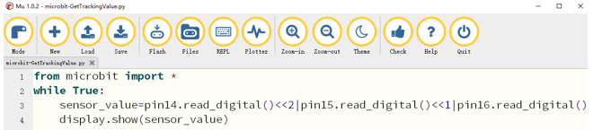
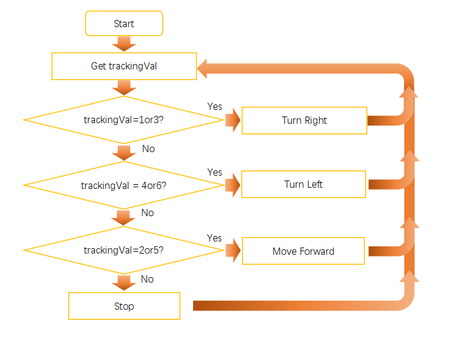

##############################################################################
Chapter Line tracking
##############################################################################

There are three Reflective Optical Sensors on Rover. When the infrared light emitted by infrared diode shines on the surface of different objects, the sensor will receive light with different intensities after reflection.

As we know, black objects absorb light better. So when black lines are drawn on the white plane, the sensor can detect the difference. In this way, we can realize Line tracking mode for Rover. The sensor can also be called Line Tracking Sensor.

Preparation

1.	Insert micro:bit into Rover correctly.

2.	Install battery into Rover. 

3.	:red:`Turn ON Rover power.`

4.	Connect micro:bit and computer through USB cable.

Warning
===========================

Reflective Optical Sensor(including Line Tracking Sensor) should be avoided using in environment with infrared interference, like sunlight, which contains a lot of invisible light such as infrared and ultraviolet. Under environment with intense sunlight, Reflective Optical Sensor cannot work normally.

Get value of LineTrackingSensor

Obtain the value of the Reflective Optical Sensor and display the LED matrix on the micro:bit.

Code
===================

Open the "microbit-GetTrackingValue.py" with the Mu software. The path of the code is as follows: ( :ref:`How to load the project code? <load>` )

+-------------+-----------------------------------------+------------------------------+
| File type   | Path                                    | File name                    |
+-------------+-----------------------------------------+------------------------------+
| Python file | ../PythonProjects/05.1_GetTrackingValue | microbit-GetTrackingValue.py |
+-------------+-----------------------------------------+------------------------------+

After the loading completes, the interface of Mu is as shown below:

Import the “Freenove_Micro_Rover.py” file into micro:bit ( :ref:`How to import files? <importpy>` ) and download the code into micro:bit. Use black and white objects to block the sensor (the shielding distance is better in 2-3cm), observe the LED matrix of micro:bit and indicator LED on the car. 

The following table shows the values of all cases when three Tracking Sensors detect objects of different colors.

Among them, 1 represents black objects or no objects are detected., and 0 represents white objects are detected.

+------+--------+-------+---------------+----------------+
| Left | Middle | Right | Value(binary) | Value(decimal) |
+======+========+=======+===============+================+
| 0    | 0      | 0     | 000           | 0              |
+------+--------+-------+---------------+----------------+
| 0    | 0      | 1     | 001           | 1              |
+------+--------+-------+---------------+----------------+
| 0    | 1      | 0     | 010           | 2              |
+------+--------+-------+---------------+----------------+
| 0    | 1      | 1     | 011           | 3              |
+------+--------+-------+---------------+----------------+
| 1    | 0      | 0     | 100           | 4              |
+------+--------+-------+---------------+----------------+
| 1    | 0      | 1     | 101           | 5              |
+------+--------+-------+---------------+----------------+
| 1    | 1      | 0     | 110           | 6              |
+------+--------+-------+---------------+----------------+
| 1    | 1      | 1     | 111           | 7              |
+------+--------+-------+---------------+----------------+

You can verify the running result of Rover with this table.

The following is the program code:

.. literalinclude:: ../../../freenove_Kit/PythonProjects/05.1_GetTrackingValue/microbit-GetTrackingValue.py
    :linenos: 
    :language: python
    :lines: 1-4
    :dedent:

Import microbit module.

.. literalinclude:: ../../../freenove_Kit/PythonProjects/05.1_GetTrackingValue/microbit-GetTrackingValue.py
    :linenos: 
    :language: python
    :lines: 1-1
    :dedent:

Read the values of the three sensors in the while loop. Returns high when the sensors (P14, P15, P16 pins) detect black or no object. Otherwise, returns low level. And the acquired values will be displayed on the LED matrix.

.. literalinclude:: ../../../freenove_Kit/PythonProjects/05.1_GetTrackingValue/microbit-GetTrackingValue.py
    :linenos: 
    :language: python
    :lines: 2-4
    :dedent:

Reference
--------------------------------

.. py:function:: read_digital()	

    Return 1 if the pin is high, and 0 if it's low.
    
    For more information, please refer to:https://microbit-micropython.readthedocs.io/en/latest/pin.html

.. py:function:: | operator	
    
    \| is a bitwise OR operation that performs an OR operation in binary bits. Operation rules: 
    
    0 | 0=0;   
    
    0 | 1=1;    
    
    1 | 0=1;     
    
    1 | 1=1
    
    For example:
    
    A=0011 1100 (0x3c)
    
    B=0011 0101 (0x35)
    
    ---------------
    
    A | B=0011 1101 (0x3d)

Rover-light tracing mode
**********************************

In this project, we will realize line tracking mode of Rover.

Flow chart
===================================

Rover will make different actions according to the value transmitted by the line tracking sensor.

+------+--------+-------+---------------+----------------+--------------+
| Left | Middle | Right | Value(binary) | Value(decimal) | Rover Action |
+------+--------+-------+---------------+----------------+--------------+
| 0    | 0      | 0     | 000           | 0              | Stop         |
+------+--------+-------+---------------+----------------+--------------+
| 0    | 0      | 1     | 001           | 1              | Turn Right   |
+------+--------+-------+---------------+----------------+--------------+
| 0    | 1      | 0     | 010           | 2              | Move Forward |
+------+--------+-------+---------------+----------------+--------------+
| 0    | 1      | 1     | 011           | 3              | Turn Right   |
+------+--------+-------+---------------+----------------+--------------+
| 1    | 0      | 0     | 100           | 4              | Turn Left    |
+------+--------+-------+---------------+----------------+--------------+
| 1    | 0      | 1     | 101           | 5              | Move Forward |
+------+--------+-------+---------------+----------------+--------------+
| 1    | 1      | 0     | 110           | 6              | Turn Left    |
+------+--------+-------+---------------+----------------+--------------+
| 1    | 1      | 1     | 111           | 7              | Stop         |
+------+--------+-------+---------------+----------------+--------------+

Flow chart is as below:

Code
=========================

Open microbit-LineTracking.py with Mu software, the path of the code is as follows:

+-------------+---------------------------------------+--------------------------+
| File type   | Path                                  | File name                |
+-------------+---------------------------------------+--------------------------+
| Python file | ../PythonProjects / 05.2_LineTracking | microbit-LineTracking.py |
+-------------+---------------------------------------+--------------------------+

After the loading completes, the interface of Mu is as shown below:

Import the “Freenove_Micro_Rover.py” file into micro:bit( :ref:`How to import files? <importpy>` ) and download the code into micro:bit. Place the car on the map we provide and observe the movement of the car. 

The following is the program code:

.. literalinclude:: ../../../freenove_Kit/PythonProjects/05.2_LineTracking/microbit-LineTracking.py
    :linenos: 
    :language: python
    :lines: 1-17
    :dedent:

Import the Freenove_Micro_Rover module.

.. literalinclude:: ../../../freenove_Kit/PythonProjects/05.2_LineTracking/microbit-LineTracking.py
    :linenos: 
    :language: python
    :lines: 1-1
    :dedent:

Create an object of the Micro_Rover class in the Freenove_Micro_Rover module.

.. literalinclude:: ../../../freenove_Kit/PythonProjects/05.2_LineTracking/microbit-LineTracking.py
    :linenos: 
    :language: python
    :lines: 2-2
    :dedent:

Display a smile on LED matrix.

.. literalinclude:: ../../../freenove_Kit/PythonProjects/05.2_LineTracking/microbit-LineTracking.py
    :linenos: 
    :language: python
    :lines: 3-3
    :dedent:

Read the values of the three sensors in the while loop. Returns high when the sensors (P14, P15, P16 pins) detect black or no object. Otherwise, returns low level. Assign the integrated value to variable “sensor_value”.

.. literalinclude:: ../../../freenove_Kit/PythonProjects/05.2_LineTracking/microbit-LineTracking.py
    :linenos: 
    :language: python
    :lines: 4-5
    :dedent:

In the code, the value of sensor_value is determined.

If sensor_value is equal to 2 or 5, the car moves forward while the LEDs emitting bright green.

If sensor_value is equal to 4 or 6, the car turns left and the LEDs emit red.

If sensor_value is equal to 1 or 3, the car turns right and the LEDs emit blue.

If sensor_value is equal to 0 or 7, the car stops and the LEDs emit purple.

.. literalinclude:: ../../../freenove_Kit/PythonProjects/05.2_LineTracking/microbit-LineTracking.py
    :linenos: 
    :language: python
    :lines: 6-17
    :dedent: