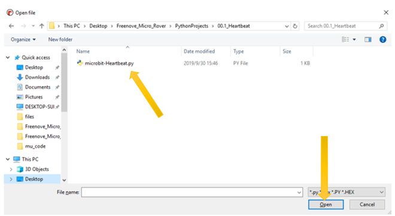

##############################################################################
Code & Programming
##############################################################################

This tutorial is written for Python language. If you want to program with graphical block code, please refer to the manual "Tutorial.pdf". In the root directory of the resource you download, there is a folder called "PythonProjects" that holds all the Python code for Rover. The name of Python code file ends with ".py". 

Python
**************************

micro:bit can be programmed in Python. Since micro:bit is a microcontroller, the hardware difference makes it not fully support Python. Here is MicroPython, which is specially designed for micro:bit. 

MicroPython is a lean and efficient implementation of the Python 3 programming language that includes a small subset of the Python standard library and is optimized to run on microcontrollers and in constrained environments.

There are two types of editors for Python code.

1.	The web version for Python code editor is here: https://python.microbit.org/v/1.1

2.	For Windows and MAC users, you can use the independent software Mu.  

(https://codewith.mu/en/download)

We highly recommend using the software Mu as the Python code editor.

.. _load:

Mu
===========================

Mu is a Python code editor for beginner programmers based on extensive feedback given by teachers and learners. 

Official website: https://codewith.mu/

You can download it here: https://codewith.mu/en/download

Download and install it. Then open it, following interface appears:

Click the Mode button in the menu bar and select "BBC micro:bit" in the pop-up dialog box. Click "OK".

Click the "Load" button, select "microbit-Heartbeat.py" in the pop-up box, and click "Open". The file path is shown in the following table. 

+-------------+----------------------------------+-----------------------+
| File type   | Path                             | File name             |
+-------------+----------------------------------+-----------------------+
| Python file | ../PythonProjects/00.1_Heartbeat | microbit-Heartbeat.py |
+-------------+----------------------------------+-----------------------+

Successful loading is shown below. You can also type the code by yourself.

Connect the micro:bit to your computer via a micro USB cable. And click the Flash button to download the program into micro:bit. 

If there are errors in your code, you may be able to successfully download the code to micro:bit, but it will not work properly. 

For example, the function sleep() was written as sleeps() in the following illustration. Click the button and the code can be uploaded to Micro:bit successfully. However, after the downloading completes, LED matrix prompts some error information and the number of the wrong line.

Click the “REPL” button and press the reset button (the button on the back, not A, B) on micro:bit. The error message will be displayed in the REPL box, as shown below:

.. image:: ../_static/imgs/Code/Code06.png
    :align: center

**Click REPL again,** you will close REPL mode. And then you can flash new code.

In order to ensure the code is correct, after completing the code, click the "Check" button to check the code for errors. As shown below, click the “Check” button, and Mu will indicate the error of the code.

According to the error prompt, modify the code correctly. Then click the "Check" button again, Mu displays no error on the bar below.

For more tutorials for using Mu, please refer to: https://codewith.mu/en/tutorials/