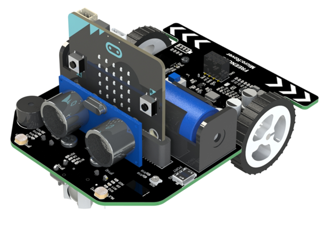
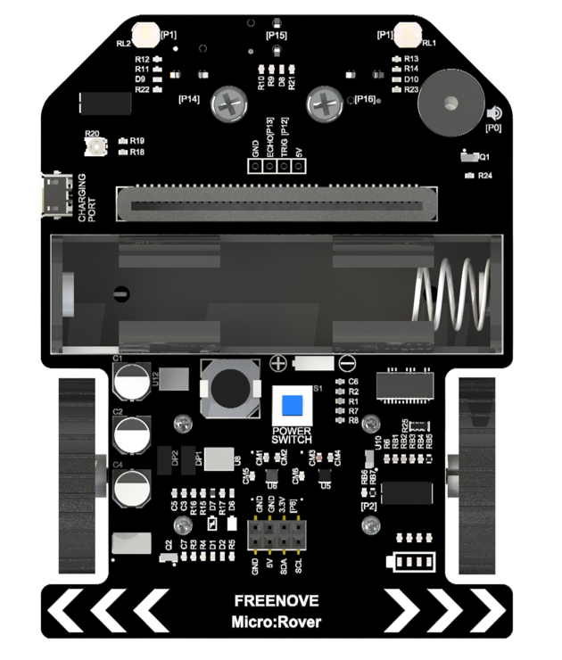
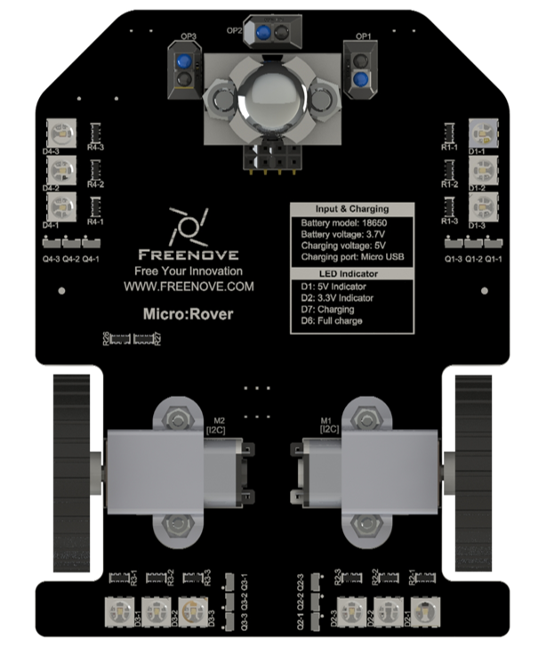
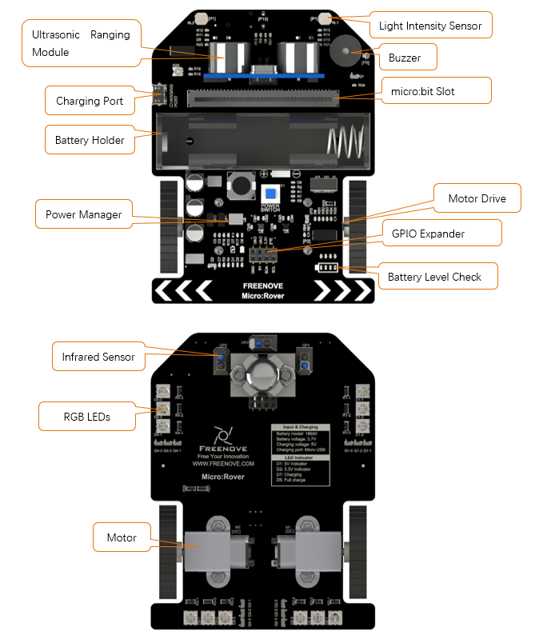
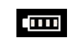
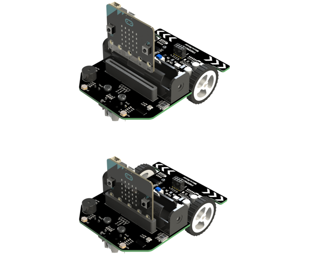
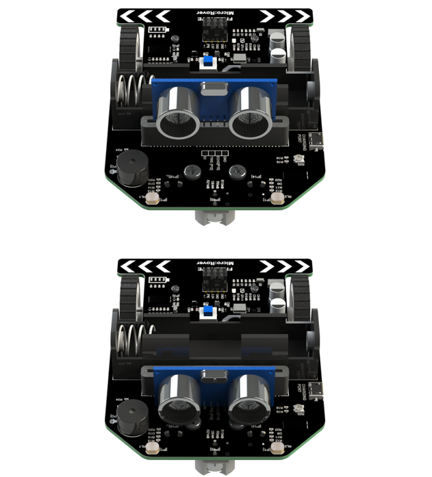
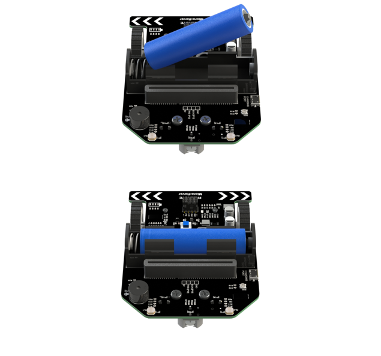

##############################################################################
Micro:Rover
##############################################################################

In this chapter, we will introduce the functions and features of Micro:Rover.

Freenove Micro:Rover is a programmable car based on BBC micro:bit. With integrated design, it does not require additional wiring, which makes it easy to use. There are ultrasonic, infrared and photosensitive sensors on it as well as buzzer, RGB LED and other peripherals. Rich hardware resources will help you master more knowledge and skills. You can use your imagination to create more ways to play the robot.

Meet micro:rover
*********************************

The Freenove Micro:Rover is a multi-functional car based on BBC micro:bit. It has rich sensors and peripherals to help you further learn how to use micro:bit and acquire knowledge about electronics.

Features
*********************************

Features of Micro:Rover:

- 4 Sets of controllable RGB LEDs (3 LEDs in each set)

- 2*Deceleration motors

- 1*Passive buzzer

- 1*Ultrasonic ranging module

- 2*Light intensity sensors

- 3*Infrared line-tracking sensors

- 1*micro:bit GPIO [P8]

- 1 Set of micro:bit I2C interface

- Battery power indication

- Battery charging and discharging management

Connection between Micro:Rover and micro:bit GPIO:

+----------------+-------------------------------------+
| micro:bit GPIO | Micro:Rover                         |
+================+=====================================+
| P0             | Buzzer                              |
+----------------+-------------------------------------+
| P1             | Light intensity sensor              |
+----------------+-------------------------------------+
| P2             | Battery voltage acquisition         |
+----------------+-------------------------------------+
| P8             | Expansion port                      |
+----------------+-------------------------------------+
| P12            | Ultrasonic ranging module trig pin  |
+----------------+-------------------------------------+
| P13            | Ultrasonic echo pin                 |
+----------------+-------------------------------------+
| P14            | Left Infrared line-tracing sensor   |
+----------------+-------------------------------------+
| P15            | Middle Infrared line-tracing sensor |
+----------------+-------------------------------------+
| P16            | Right Infrared line-tracing sensor  |
+----------------+-------------------------------------+
| P19-I2C SCL    |                                     |
+----------------+ Motors, RGBLEDs, I2C extension port |
| P20-I2C SDA    |                                     |
+----------------+-------------------------------------+

Battery & Charging
****************************************

Freenove Micro:Rover is powered by one 18650 battery. The extended battery holder can be compatible with any type of 18650 batteries, no matter it is pointed/flat/with or without protective plate. The discharge current of the battery should be at least 2A.

You can charge the battery with a USB port or a common USB charger. The maximum charging current is 700 mA.

:red:`Please note: this product does not contain battery.`

Indicator
*******************************

Some LEDs are integrated on Rover, different states of each have various meanings. . You can learn the working state of Rover better through them.

+-----+-----------------------------+-----------------------------------+------------------------------+
| LED |     Indicating content      |              LED On               |           LED Off            |
+=====+=============================+===================================+==============================+
| D1  | 5V circuit                  | 5V circuit is working.            | 5V circuit is not working.   |
+-----+-----------------------------+-----------------------------------+------------------------------+
| D2  | 3.3V circuit                | 3.3V circuit is working.          | 3.3V circuit is not working. |
+-----+-----------------------------+-----------------------------------+------------------------------+
| D8  | Middle line-tracking sensor | Black object is detected or       | White object is detected     |
+-----+-----------------------------+                                   |                              |
| D9  | Left line-tracking sensor   | no object is detected.            |                              |
+-----+-----------------------------+                                   |                              |
| D10 | Right line-tracking sensor  |                                   |                              |
+-----+-----------------------------+-----------------------------------+------------------------------+

+----------+----------+-----------------------------------------------+
| D7 State | D6 State | Indicating meaning                            |
+----------+----------+-----------------------------------------------+
| On       | Off      | Charging.                                     |
+----------+----------+-----------------------------------------------+
| Off      | On       | Charging is complete and the battery is full. |
+----------+----------+-----------------------------------------------+
| Blink    | On       | The charger did not detect the battery.       |
+----------+----------+-----------------------------------------------+
| Off      | Off      | The boost circuit is working.                 |
+----------+----------+-----------------------------------------------+

On bottom right corner of Rover, four LEDs are used to indicate battery level, as shown blow. 

Assemble
**************************************

Install micro:bit
==================================

Install ultrasonic ranging module
====================================

Install battery
==================================

