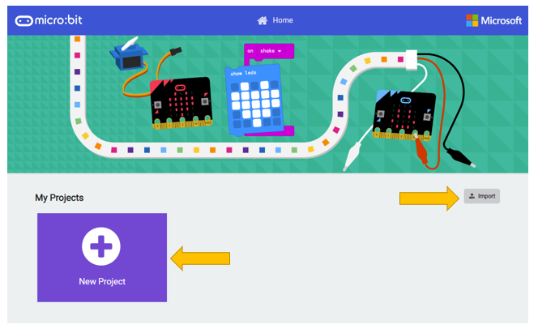
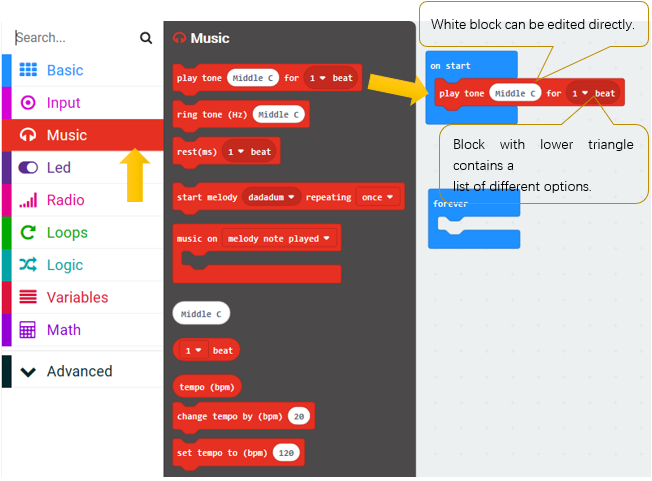
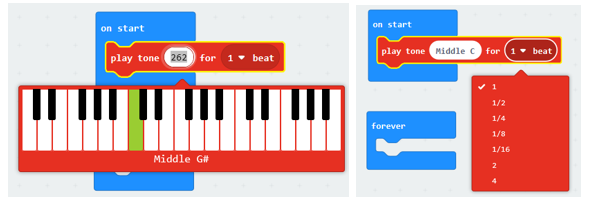
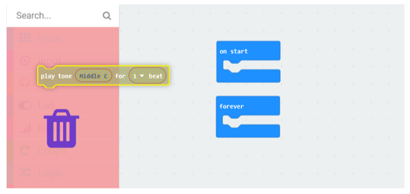
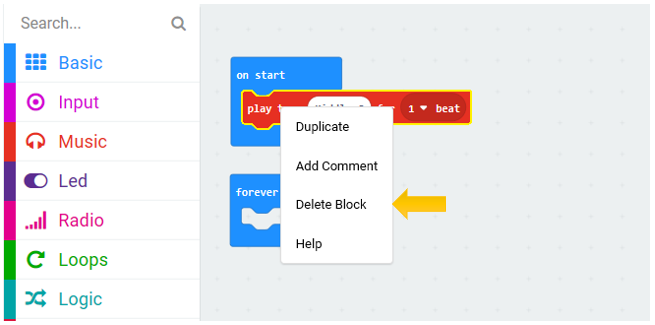
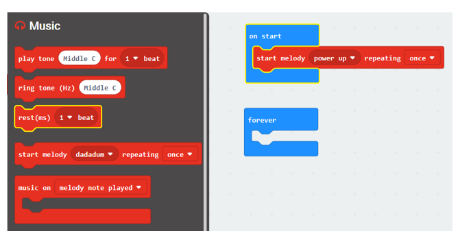
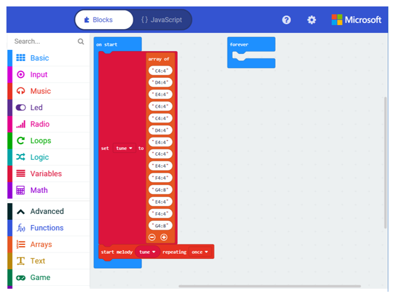

##############################################################################
Chapter Music
##############################################################################

The buzzer integrated on Rover can be used to play music. You can create and play music on Rover with blocks of Music library in MakeCode.

If you have any concerns, please feel free to contact us at support@freenove.com

Preparation
********************************

1. Insert micro:bit into Rover correctly.

2. Install battery into Rover. 

:red:`3. Turn ON Rover power.`

4. Connect micro:bit and computer through USB cable.
  
Open web version or windows 10 app version of MakeCode.

If you want to load the whole project directly, click "Import".

( :ref:`How to import? <import>` )

If you want to drag the code block one by one, click "new project".

Play a note
****************************

First, we play a note on the Rover.

Load code according to the table below (How to load?) or drag the code block as shown in the picture below:

+-----------+------------------------------+--------------------------+
| File type | Path                         | File name                |
+-----------+------------------------------+--------------------------+
| Hex file  | ../Projects/01.1_Play-a-note | microbit-Play-a-note.hex |
+-----------+------------------------------+--------------------------+

The meaning of this code is: playing note Middle C lasting for one beat. You can change the note and beat by clicking elliptical area in code block.

If you want to delete a code block, you can drag the block to the left extension area.

Or select the block in the code area and press "Delete" key.

Or right click on the block and select "Delete Block".

Download the code to micro:bitwith the method mentioned earlier, and Rover will play the notes and rhythms. 

(How to download?  How to quick download?)

If there is a downloading problem, disconnect USB and micro:bit, then reconnect them and reopen MakeCode to try downloading again.

Play a melody
******************************

Load code according to the table below or drag the code block as shown in the picture below:

+-----------+--------------------------------+----------------------------+
| File type | Path                           | File name                  |
+-----------+--------------------------------+----------------------------+
| Hex file  | ../Projects/01.2_Play-a-melody | microbit-Play-a-melody.hex |
+-----------+--------------------------------+----------------------------+

In this drop-down list of this code block, there are dozens of melodies to choose. You can choose any one.

Then download the code to micro:bit, and Rover will play melody of the code.

Play custom melody
********************************

Load code according to the table below or drag the code block as shown in the picture below:

+-----------+--------------------------------+----------------------------+
| File type | Path                           | File name                  |
+-----------+--------------------------------+----------------------------+
| Hex file  | ../Projects/01.3_Custom-Melody | microbit-Custom-Melody.hex |
+-----------+--------------------------------+----------------------------+

In this code, an array is used to define a melody. Each data represents a note and a beat. For example, "C4:4" means that the note is C4 and the beat is 4. "G4:8" means that the note is G4 and the beat is 8. So you can create your own music.

Download the code to micro:bit, and Rover will play melody of the code. 