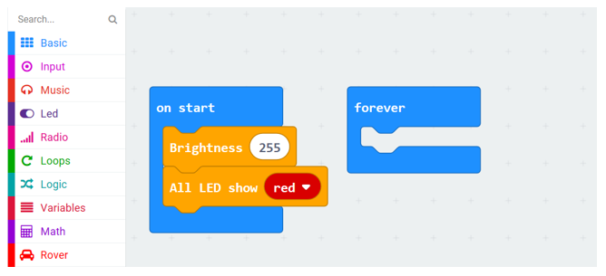
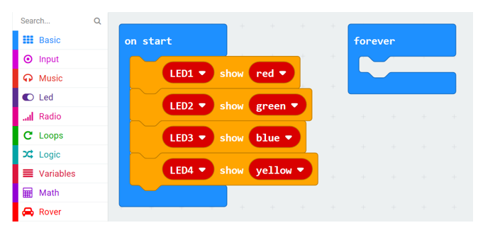
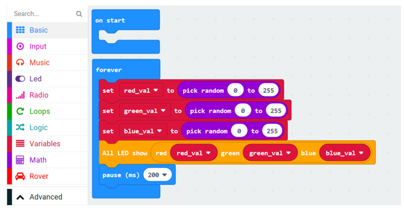
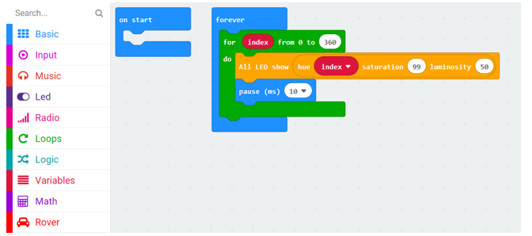
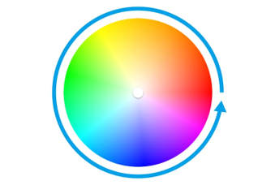

##############################################################################
Chapter RGB LED
##############################################################################

There are four sets of RGBLEDs integrated on Rover, each has three RGBLEDs and can be controlled independently. You can control the brightness and color of the LEDs through the blocks in the Rover library to show 16 million colors. Now create your own RGB light. 

If you have any concerns, please feel free to contact us at support@freenove.com

Preparation
*****************************

1.	Insert micro:bit into Rover correctly.

2.	Install battery into Rover. 

3.	Turn ON Rover power.

4.	Connect micro:bit and computer through USB cable.

5.	Rover White paper or Rover tracking map. (Optional)

This chapter will introduce RGB LED of Rover.

Put Rover on a piece of white paper, which will make the color displayed more clearly.

Open web version of MakeCode or windows 10 app version.

If you choose to load the project by importing Hex file, there is no need to add the Rover extension manually.

( :ref:`How to import? <import>` )

:red:`If you choose to drag code manually, you first need to add Rover extensions.`

( :ref:`How to add Rover extension? <extension>` )

Emitting one color of light
**************************************

First let all RGB LEDs of Rover emit same color and same brightness.

Load code according to the table below or drag the code block as shown in the picture below:

+-----------+-------------------------------+---------------------------+
| File type | Path                          | File name                 |
+-----------+-------------------------------+---------------------------+
| Hex file  | ../Projects/02.1_LED-OneColor | microbit-LED-OneColor.hex |
+-----------+-------------------------------+---------------------------+

In this code, set brightness of all RGBLED to 255 and set the color for all to red.

You can modify brightness in the range of 0~255 and choose different color.

Download the code to micro:bit. All RGBLEDs on Rover will emit red light.

Emitting different colors of light
***************************************

Load code according to the table below or drag the code block as shown in the picture below:

+-----------+--------------------------------------+----------------------------------+
| File type | Path                                 | File name                        |
+-----------+--------------------------------------+----------------------------------+
| Hex file  | ../Projects/02.2_LED-DifferentColors | microbit-LED-DifferentColors.hex |
+-----------+--------------------------------------+----------------------------------+

In this code, set color of RGBLED1,2,3,4 to red, green, blue, and yellow respectively.

Download the code to micro:bit. All RGBLEDs on Rover will emit red light.

Emitting random color of light
**************************************

Load code according to the table below or drag the code block as shown in the picture below:

+-----------+-----------------------------------+-------------------------------+
| File type | Path                              | File name                     |
+-----------+-----------------------------------+-------------------------------+
| Hex file  | ../Projects/02.3_LED-RandomColors | microbit-LED-RandomColors.hex |
+-----------+-----------------------------------+-------------------------------+

In this code, three variables(red_val, green_val and blue_val) are defined. Three Random values between 0 and 255 are assigned to them respectively. These three values are used as parameters of RGB LED. Then all RGBLEDs will emit random color.

Download the code to micro:bit, and then observe the coloremitted by RGBLED on Rover.

Emitting soft colors
********************************

Load code according to the table below or drag the code block as shown in the picture below:

+-----------+---------------------------------+-----------------------------+
| File type | Path                            | File name                   |
+-----------+---------------------------------+-----------------------------+
| Hex file  | ../Projects/02.4_LED-SoftColors | microbit-LED-SoftColors.hex |
+-----------+---------------------------------+-----------------------------+

In this code, HSL color model is used, as shown below.

The hue range is 0-360. The saturation range is 0-99 and the intensity(lightness) range is 0-99.

Download the code to micro:bit and then observe the color emmited by RGBLED on Rover.