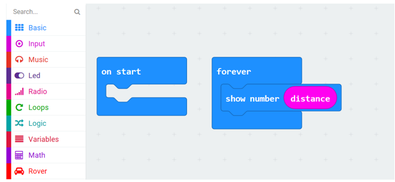

##############################################################################
Chapter Ultrasonic Ranging
##############################################################################

The ultrasonic module on Rover can measure the distance between Rover and the obstacle in front of it. Therefore,  we can take advantage of this characteristic to make Rover avoid obstacle. When Rover is close to the obstacle in the front, let it turn to avoid the obstacle.

If you have any concerns, please feel free to contact us at support@freenove.com

Preparation
*********************************

1.	Insert micro:bit into Rover correctly.

2.	Install ultrasonic ranging module on Rover.

3.	Install battery into Rover. 

4.	Turn ON Rover power.

5.	Connect micro:bit and computer through USB cable.

Open web version of MakeCode or windows 10 app version.

If you choose to load the project by importing Hex file, there is no need to add the Rover extension manually.

( :ref:`How to import? <import>` )

:red:`If you choose to drag code manually, you first need to add Rover extensions.`

( :ref:`How to add Rover extension? <extension>` )

Obtain value of ultrasonic ranging
*********************************************

Load code according to the table below or drag the code block as shown in the picture below:

+-----------+--------------------------+----------------------+
| File type | Path                     | File name            |
+-----------+--------------------------+----------------------+
| Hex file  | ../Projects/03.1_Ranging | microbit-Ranging.hex |
+-----------+--------------------------+----------------------+

This code is used to make LED matrix of micro:bit show the distance value detected by ultrasonic ranging.

Place an obstacle in front of ultrasonic ranging module. Download the code to micro:bit, and then change the distance between the two objects, and observe the value of showed on LED matrix of micro:bit.

Rover-Obstacle avoidance mode -1
****************************************

In this project, we will realize the obstacle avoidance mode of Rover.

Flow chart
==============================

The program code is written according to flow chart, as shown below.

Code
=============================

Load code according to the table below or drag the code block as shown in the picture below:

+-----------+---------------------------------------+-----------------------------------+
| File type | Path                                  | File name                         |
+-----------+---------------------------------------+-----------------------------------+
| Hex file  | ../Projects/03.2_Obstacle-Avoidance-1 | microbit-Obstacle-Avoidance-1.hex |
+-----------+---------------------------------------+-----------------------------------+

In this code, code block 

is used to set speed of both motors to a certain value. Positive value means moving forward, and negative value means moving backward.

Code block

is used to set speed of left motor and right motor. When the value is different, Rover will turn.

Download the code to micro:bit, and then observe the motion of Rover.

Rover-Obstacle avoidance mode -2
*****************************************

This project will combine RGBLED and LED matrix to provide some auxiliary instructions for obstacle avoidance mode.

Code
================================

Load code according to the table below or drag the code block as shown in the picture below:

+-----------+---------------------------------------+-----------------------------------+
| File type | Path                                  | File name                         |
+-----------+---------------------------------------+-----------------------------------+
| Hex file  | ../Projects/03.2_Obstacle-Avoidance-2 | microbit-Obstacle-Avoidance-2.hex |
+-----------+---------------------------------------+-----------------------------------+

In this code, the logic is exactly the same as previous section. The difference is that when measured distances are different, RGBLEDs will show different colors. The color will change from red to green when the distance changes from near to far.

Download the code to micro:bit, and then observe motion of Rover and the display of RGBLED and LED matrix.