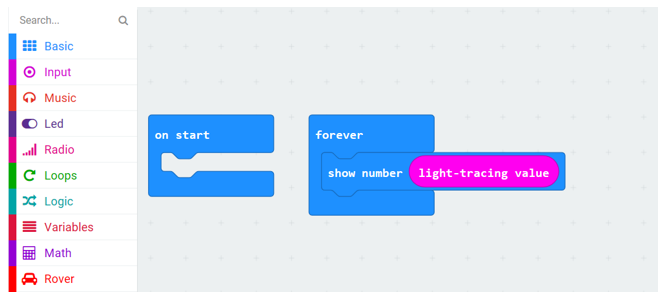
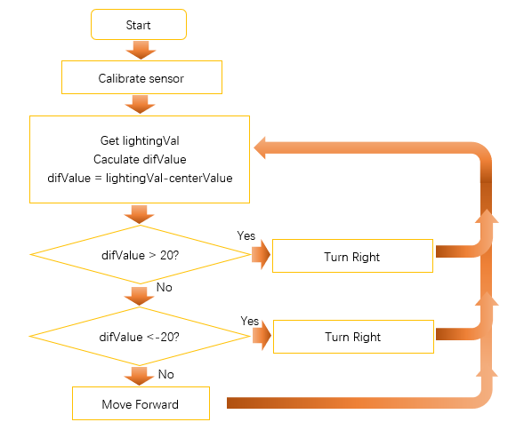
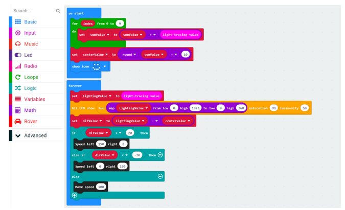

##############################################################################
Chapter Light tracing
##############################################################################

There are two light intensity sensors on Rover, so we can learn which sensor receives more intensive light based on the difference between the values of the two sensors. In this way, Rover can achieve the function of tracking or avoiding light.

If you have any concerns, please feel free to contact us at support@freenove.com

Preparation
****************************

1.	Insert micro:bit into Rover correctly.

2.	Install battery into Rover. 

3.	Turn ON Rover power.

4.	Connect micro:bit and computer through USB cable.

Open web version of MakeCode or windows 10 app version.

If you choose to load the project by importing Hex file, there is no need to add the Rover extension manually.

( :ref:`How to import? <import>` )

:red:`If you choose to drag code manually, you first need to add Rover extensions.`

( :ref:`How to add Rover extension? <extension>` )

Get value of light intensity sensor
*************************************************

Load code according to the table below or drag the code block as shown in the picture below:

+-----------+------------------------+--------------------+
| File type | Path                   | File name          |
+-----------+------------------------+--------------------+
| Hex file  | ../Projects/04.1_Light | microbit-Light.hex |
+-----------+------------------------+--------------------+

In this code, the block light-tracing value represents the acquired value (β) of the light intensity sensor, which is jointly generated by the two sensors. Its range is 0~1023.

Theoretically,

If β = 512, it indicates that light intensities sensed by two sensors are equal.

If β > 512, it indicates that light intensity sensed by right sensor is stronger than left sensor.

If β < 512, it indicates that light intensity sensed by left sensor is stronger than right sensor.

But in fact, due to the difference of the sensors and the working voltage. When the two light sensors detect the same intensity, β (the center value) may be not 512, but a number near 512. So when we use this sensor, we should calibrate it first.

Download the code to Micro:bit. And use a light source to illuminate one light intensity sensor, or use your finger to cover it, and then observe the values showed on micro:bit LED matrix.

Rover-light tracing mode
*************************************

In this project, we will realize the light tracing mode of Rover.

Flow chart
================================

The program code is written according to flow chart, as shown below.

Code
=============================

Load code according to the table below:

+-----------+-------------------------------+---------------------------+
| File type | Path                          | File name                 |
+-----------+-------------------------------+---------------------------+
| Hex file  | ../Projects/04.2_LightTracing | microbit-LightTracing.hex |
+-----------+-------------------------------+---------------------------+

As mentioned before, when using light sensors, we need to calibrate them first. Therefore, in the code, the sensor values are read 10 times after booting up, and their sum is made, then the average is taken as the center value after calibration.

After the sensor value is got, it will be compared with the centerValue to get the difference (difValue). And Rover will make different actions according to the difference.

The RGB LED show is added in the code. Different sensor values will be mapped to different colors.

Download the code to micro:bit. In order to improve accuracy of the calibration, put the two light sensors in the same light intensity environment when booting. Wait for the micro:bit LED Matrix to show a smile, which indicates that the calibration is completed.

Then use a flashlight or other light source to illuminate the light intensity sensor and observe the motion of Rover.