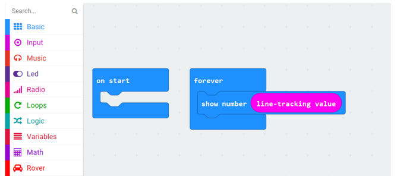
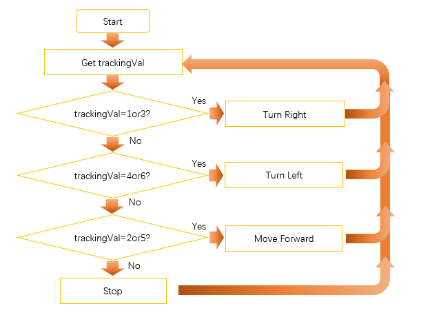
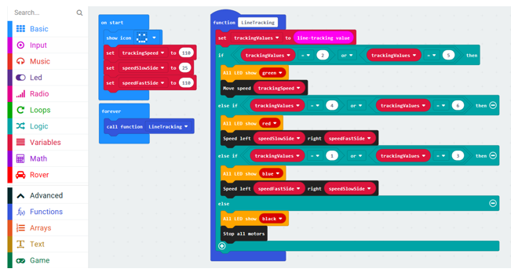
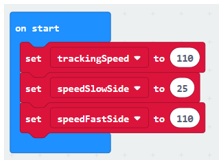
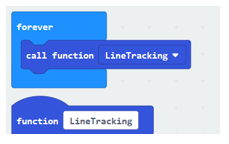

##############################################################################
Chapter Line tracking
##############################################################################

There are three Reflective Optical Sensors on Rover. When the infrared light emitted by infrared diode shines on the surface of different objects, the sensor will receive light with different intensities reflected by the objects..

As we know, black objects absorb light better. So when black lines are drawn on the white plane, the sensor can detect the difference. So we can realize Line tracking mode for Rover. The sensor can also be called Line Tracking Sensor.

If you have any concerns, please feel free to contact us at support@freenove.com

Preparation
****************************

1.	Insert micro:bit into Rover correctly.

2.	Install battery into Rover. 

3.	Turn on Rover power.

4.	Connect micro:bit and computer through USB cable.

Open web version of MakeCode or windows 10 app version .

If you choose to load the project by importing Hex file, there is no need to add the Rover extension manually.

( :ref:`How to import? <import>` )

:red:`If you choose to drag code manually, you first need to add Rover extensions.`

( :ref:`How to add Rover extension? <extension>` )

Warning
===============================

:red:`Reflective Optical Sensor(including Line Tracking Sensor) should be avoided using in environment with infrared interference, like sunlight. Sunlight contains a lot of invisible light such as infrared and ultraviolet. Under environment with intense sunlight, Reflective Optical Sensor cannot work normally.`

Get value of LineTrackingSensor
*******************************************

Load code according to the table below or drag the code block as shown in the picture below:

+-----------+-----------------------------------+-------------------------------+
| File type | Path                              | File name                     |
+-----------+-----------------------------------+-------------------------------+
| Hex file  | ../Projects/05.1_GetTrackingValue | microbit-GetTrackingValue.hex |
+-----------+-----------------------------------+-------------------------------+

Download the code to micro:bit. Approach the Tracking Sensor with black and white objects, respectively, and observe the values showed by the indicator and the Micro: bit led matrix.

The following table shows the values of all cases when three Tracking Sensors detect objects of different colors.

Among them, 1 presents black objects or no objects were detected, and 0 indicates white objects were detected.

+------+--------+-------+---------------+----------------+
| Left | Middle | Right | Value(binary) | Value(decimal) |
+------+--------+-------+---------------+----------------+
| 0    | 0      | 0     | 000           | 0              |
+------+--------+-------+---------------+----------------+
| 0    | 0      | 1     | 001           | 1              |
+------+--------+-------+---------------+----------------+
| 0    | 1      | 0     | 010           | 2              |
+------+--------+-------+---------------+----------------+
| 0    | 1      | 1     | 011           | 3              |
+------+--------+-------+---------------+----------------+
| 1    | 0      | 0     | 100           | 4              |
+------+--------+-------+---------------+----------------+
| 1    | 0      | 1     | 101           | 5              |
+------+--------+-------+---------------+----------------+
| 1    | 1      | 0     | 110           | 6              |
+------+--------+-------+---------------+----------------+
| 1    | 1      | 1     | 111           | 7              |
+------+--------+-------+---------------+----------------+

You can verify the running result of Rover with this table.

Rover-line tracking mode
****************************************

This project will realize line tracking mode of Rover.

Flow chart
====================================

Rover will make different actions according to the value transmitted by the line tracking sensor.

+------+--------+-------+---------------+----------------+--------------+
| Left | Middle | Right | Value(binary) | Value(decimal) | Rover Action |
+------+--------+-------+---------------+----------------+--------------+
| 0    | 0      | 0     | 000           | 0              | Stop         |
+------+--------+-------+---------------+----------------+--------------+
| 0    | 0      | 1     | 001           | 1              | Turn Right   |
+------+--------+-------+---------------+----------------+--------------+
| 0    | 1      | 0     | 010           | 2              | Move Forward |
+------+--------+-------+---------------+----------------+--------------+
| 0    | 1      | 1     | 011           | 3              | Turn Right   |
+------+--------+-------+---------------+----------------+--------------+
| 1    | 0      | 0     | 100           | 4              | Turn Left    |
+------+--------+-------+---------------+----------------+--------------+
| 1    | 0      | 1     | 101           | 5              | Move Forward |
+------+--------+-------+---------------+----------------+--------------+
| 1    | 1      | 0     | 110           | 6              | Turn Left    |
+------+--------+-------+---------------+----------------+--------------+
| 1    | 1      | 1     | 111           | 7              | Stop         |
+------+--------+-------+---------------+----------------+--------------+

Flow chart is as below:

Code
=========================

Load code according to the table below:

+-----------+-------------------------------+---------------------------+
| File type | Path                          | File name                 |
+-----------+-------------------------------+---------------------------+
| Hex file  | ../Projects/05.2_LineTracking | microbit-LineTracking.hex |
+-----------+-------------------------------+---------------------------+

This code uses three additional variables to set speeds and uses one subfunction.

Among them, trackingSpeed is used to set the Rover's speed moving forward. It is not recommended to be too large, in order to avoid running out of the runway. Variables speedSlowSide and speedFastSide are used to set the turning speed, and the smaller the difference between them, the smoother the turning, but the harder to pass through sharp turn. The larger the difference, the less smooth the turning, but the easier to pass through the sharp turn. For the specific runway we provide, the default speed in the program is enough. For a custom runway, you need to debug the most appropriate speed.

"Call function LineTracking" is equivalent to putting everything in the subfunction LineTracking in forever block. And we will see many such usage later.

Download the code to micro:bit, put Rover on Line-Tracking Map comes with in this kit and then observe motion of Rover.