##############################################################################
Chapter Bluetooth
##############################################################################

The micro:bit integrates a BLE(Bluetooth Low Energy) device with low power consumption, which can be connected and paired with smartphones through Bluetooth. Accordingly, we can create communication between micro:bit and mobile phone, and use app to control Rover’s action to realize the function of a wireless remote control.

If you have any concerns, please feel free to contact us at support@freenove.com

Preparation
********************************

1.	Insert micro:bit into Rover correctly.

2.	Install battery into Rover. 

3.	Turn on Rover power.

4.	Connect micro:bit and computer through USB cable.

5.	Android mobile phone

6.	Android app Freenove.(How to get android app?)

Open web version of MakeCode or windows 10 app version.

**If you choose to load the project by importing Hex file, there is no need to add the Rover extension manually.**

( :ref:`How to import? <import>` )

:red:`If you choose to drag code manually, you first need to add Rover extensions.`

( :ref:`How to add Rover extension? <extension>` ) Due to the limitation of micro:bit hardware, Bluetooth and Radio cannot work at the same time, so their extension library is not compatible with each other. When installing Bluetooth extension library, you will be prompted to delete Radio extensions. Just confirm the removing.

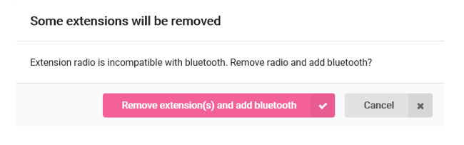

Getting Bluetooth Data
*********************************

This section is to analyze Bluetooth data, which is theoretical. If you have no interest in it, you can skip to next section. It won’t affect the experiencing of future projects.

Get Bluetooth data and print the original Bluetooth data in MakeCode through uart.

Since the code in this section uses the uart printing function, the execution of this code must use the Windows 10 App, or Google Chrome with webUSB feature (how to use?) to see the same result. If you are familiar with uart, you can also use a third-party serial tool.

Flow chart
============================

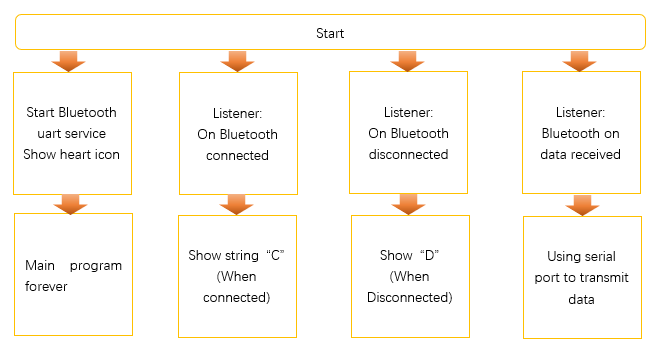

Code
==============================

Load code according to the table below or drag the code block as shown in the picture below:

+-----------+---------------------------------+-----------------------------+
| File type | Path                            | File name                   |
+-----------+---------------------------------+-----------------------------+
| Hex file  | ../Projects/06.1_Bluetooth-Uart | microbit-Bluetooth-Uart.hex |
+-----------+---------------------------------+-----------------------------+

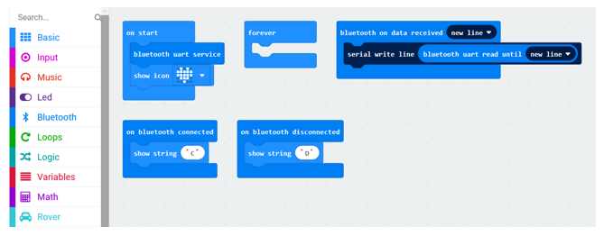

Then click gear icon(settings) -> Project Settings.

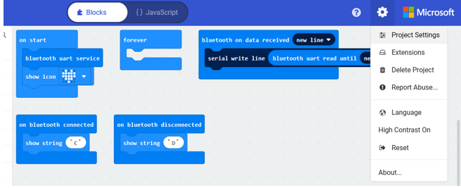

When the following page appears, set "No Pairing Required" to open state as below.

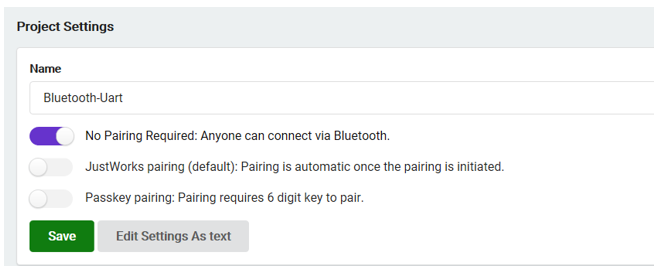

Click Save button.

Download the code to micro:bit. Later, the LED matrix of micro:bit will show heart pattern. 

Open Freenove android app. Click on Micro:Rover. Then click Rover icon in the upper left corner to search Bluetooth device. Then click your micro:bit in the search list to connect. After the connection is successful, “Connected” is showed in the status bar above. In this process, there may be a pop-up window asking for permission to obtain location. Click OK, otherwise Bluetooth will not be searched.

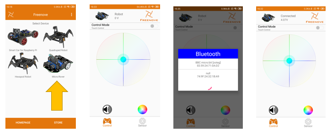

Click or drag the operating disk at the bottom, or click on the speaker, color plate or other controller to view the data received in MakeCode.

In MakeCode, when data is received, there will be a “ShowConsoleDevice” button below the simulator. Then click this button to view the received serial data.

If you use web version of MakeCode without webUSB function, you will not see the “ShowConsoleDevice” button.

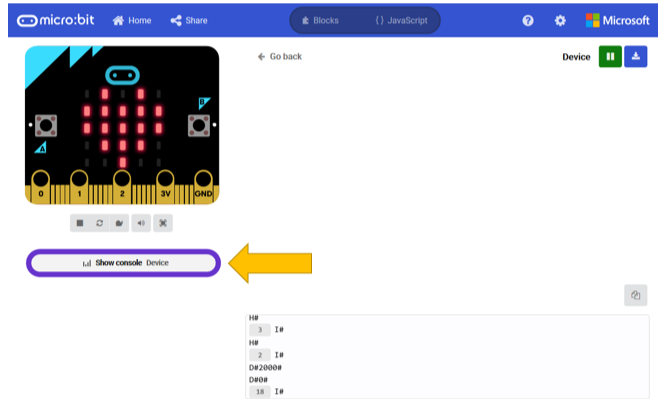

Data analysis
================================

Learning the data commands sent from app will help to understand and analyze later program.

The command format for communication between app and micro:bit is A#xxx#xxx#...xxx#, where # is a separator, the first character A represents the action command, the following xxx represents the parameters of the action command. And different commands carries different parameters. The command list is as below:

+----------------+-----------------------------------+-------------------+----------------------+--------------------+
| Action command | Description                       | Command character | Number of parameters | Format example     |
|                |                                   |                   |                      |                    |
|                |                                   |                   | (app send/receive)   | (app send/receive) |
|                |                                   |                   |                      |                    |
+----------------+-----------------------------------+-------------------+----------------------+--------------------+
| MOVE           | Move, parameters are speeds of    | A                 | 2                    | A#100#100#         |
|                |                                   |                   |                      |                    |
|                | the two motors                    |                   |                      |                    |
+----------------+-----------------------------------+-------------------+----------------------+--------------------+
| STOP           | Stop moving                       | B                 | 0                    | B#                 |
+----------------+-----------------------------------+-------------------+----------------------+--------------------+
| ORDER_RGB      | Control RGBLED, parameters        | C                 | 3                    | C#15#100#150#200#  |
|                |                                   |                   |                      |                    |
|                | respectively are serial number of |                   |                      |                    |
|                |                                   |                   |                      |                    |
|                | LED, red value, green value, blue |                   |                      |                    |
|                |                                   |                   |                      |                    |
|                | value.                            |                   |                      |                    |
+----------------+-----------------------------------+-------------------+----------------------+--------------------+
| BUZZER         | Control buzzer, and parameter     | D                 | 1                    | D#2000#            |
|                |                                   |                   |                      |                    |
|                | is the frequency.                 |                   |                      |                    |
|                |                                   |                   |                      |                    |
+----------------+-----------------------------------+-------------------+----------------------+--------------------+
| DISTANCE       | Get the distance of ultrasonic    | E                 | 0/1                  | E# /E#50#          |
|                |                                   |                   |                      |                    |
|                | measurement                       |                   |                      |                    |
|                |                                   |                   |                      |                    |
+----------------+-----------------------------------+-------------------+----------------------+--------------------+
| LIGHTING       | Get the value of the light sensor | F                 | 0/1                  | F# /F#512#         |
+----------------+-----------------------------------+-------------------+----------------------+--------------------+
| TRACKING       | Get the value of the tracking     | G                 | 0/1                  | G# /G#2#           |
|                |                                   |                   |                      |                    |
|                | sensor                            |                   |                      |                    |
+----------------+-----------------------------------+-------------------+----------------------+--------------------+
| MODE           | Set motion mode of Rover          | H                 | 1                    | H#1#               |
+----------------+-----------------------------------+-------------------+----------------------+--------------------+
| VOLTAGE        | Get the battery voltage of Rover, | I                 | 0/1                  | I# /I#4100#        |
|                |                                   |                   |                      |                    |
|                | parameter is the voltage value,   |                   |                      |                    |
|                |                                   |                   |                      |                    |
|                | unit mV                           |                   |                      |                    |
+----------------+-----------------------------------+-------------------+----------------------+--------------------+
| ECHO_OK        | Answer                            | J                 | 0                    | J#                 |
+----------------+-----------------------------------+-------------------+----------------------+--------------------+
| NONE           | None                              | K                 | 0                    | K#                 |
+----------------+-----------------------------------+-------------------+----------------------+--------------------+

.. warning::
    
       the maximum data length supported by micro:bit Bluetooth in one transmission is 20 bytes, and the part exceeding 20 bytes will be lost.

Bluetooth pairing
*****************************

In previous settings, we switched on the option “no need for pairing”, which facilitates us to debug the program.

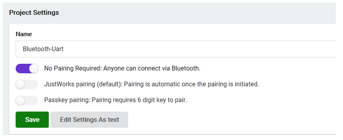

However, it also means that any compatible Bluetooth can be connected to your micro:bit, just like a WIFI without a password. Obviously this is not safe, because micro:bit can only be connected to one Bluetooth device a time. So once someone connects to your micro:bit, you won't be able to connect to your micro:bit.

The default option is “JustWorks pairing”,

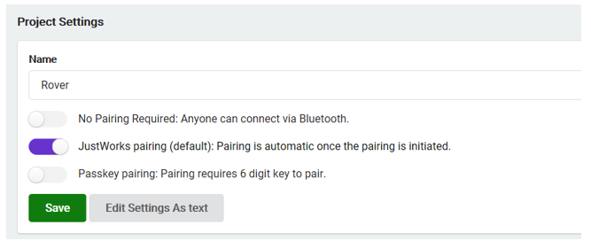

With this option, your micro:bit cannot be found by others. It can only be connected to the Bluetooth device paired before.

Pair
=============================

The following is the method to pair micro:bit:

**Power the micro:bit. If you are not using USB,** press and hold **A+B+Reset** buttons at the same time. About 3 seconds later, the LED matrix on micro:bit starts to light up one by one. **After all LEDs light up, release all buttons.** The LED matrix will show a Bluetooth icon, and then show a pattern which is the pairing code. Different micro:bit shows different pattern.

**If you are using USB power supply,** press and hold **A+B** buttons at the same time and then short press Reset button. Then continue to keep A+B pressed. Then the LED matrix of micro:bit starts to light up one by one. **After all LEDs light up, release all buttons.** The LED matrix will show a Bluetooth icon, and then show a pattern which is the pairing code. Different micro:bit shows different pattern.

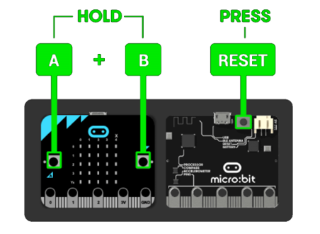

At this point, the micro:bit Bluetooth can be searched. Open the phone settingsBluetooth, search Bluetooth, and pair with micro:bit.

During the pairing process, you may need to manually enter the connection key. Pay attention to the change of the LED matrix on the micro:bit. When an arrow-left pointing to the Button A is showed, press the button A, the micro:bit will show the connection key in turn. Record and Input the key in the phone. After the connection is successful, micro:bit will show a check mark, which means the pairing is successful.

Note that the micro:bit can only be paired with one Bluetooth at a time. When micro:bit is paired with other Bluetooth devices, you must re-pair to use. In other words, the same mobile phone can be paired with multiple micro:bits, but the same micro:bit can only be paired with one mobile phone. 

If micro:bit(1) is successfully paired with mobile phone A, at this point, if it is then paired with mobile phone B,micro:bit(1) will lose the pairing information with the mobile phone A. And mobile phone A must clear its pairing information and re-pair it with micro:bit(1) to use.

If you want to make multiple phones connected to one micro:bit at any time, you can select "No pairing Required" in the Settings of MakeCode as before.

You can decide whether you want to choose the pairing requirement. In the following projects, the default is no pairing requirement.

Rover-Remote control mode
************************************

Based on the previous Bluetooth knowledge, let's realize Bluetooth remote control mode of Rover.

Flow chart
==============================

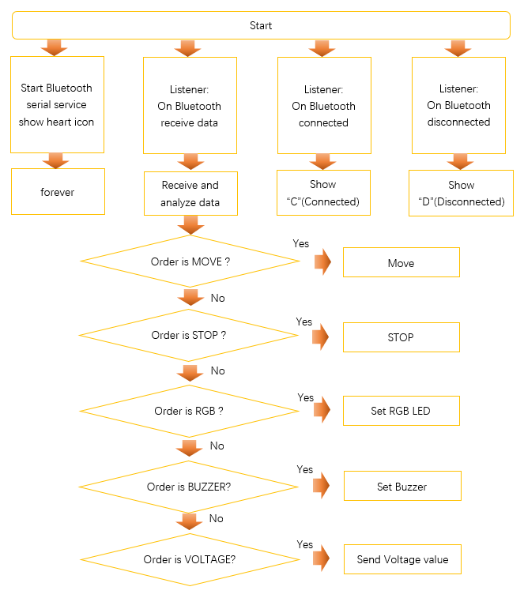

Code
=================================

Load code according to the table below:

+-----------+-----------------------------------+-------------------------------+
| File type | Path                              | File name                     |
+-----------+-----------------------------------+-------------------------------+
| Hex file  | ../Projects/06.2_Bluetooth-Remote | microbit-Bluetooth-Remote.hex |
+-----------+-----------------------------------+-------------------------------+

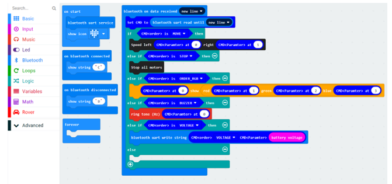

This code enables micro:bit to receive the command of APP through Bluetooth, and execute corresponding actions according to different commands.

In “Project Settings”, Switch “No Pairing Required” to open state.

Download the code to micro:bit. Later, LED matrix of micro:bit will show heart pattern.

Open Android app Freenove and connect to Rover via Bluetooth according to previous method. When the connection is successful, the LED matrix on micro:bit will show letter C. Click one psotion on control panel or drag the dot on control panel, then Rover will move accordingly. Click on the icon of the speaker, then Rover's buzzer will sound. Click on the color panel to control the color of RGB LED on Rover. We will introduce sensors in next section.

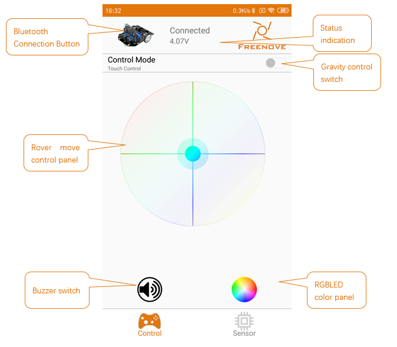