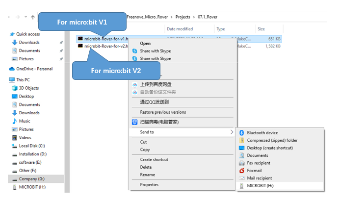
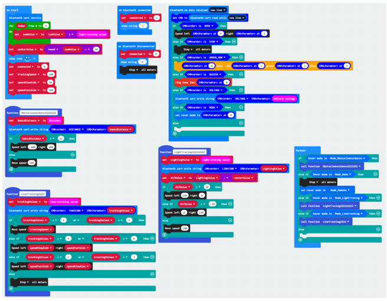
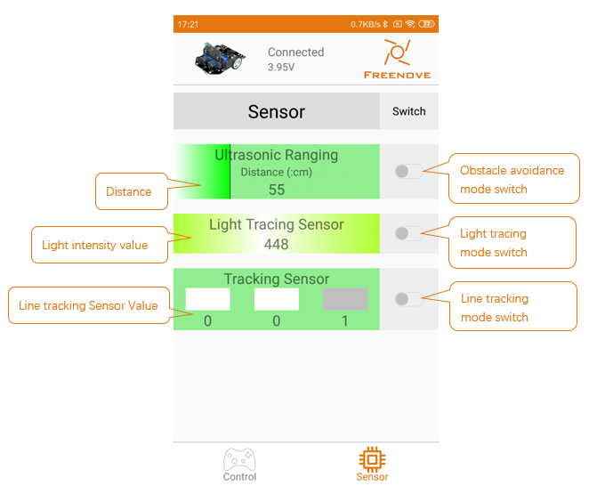

##############################################################################
Chapter Android and iOS App
##############################################################################

You may have noticed that on Android app. There is a tag "Sensor" that is not introduced. This chapter will combine all previous contents and write all the functions in one program to realize the remaining functions of the app.

If you have any concerns, please feel free to contact us at support@freenove.com

Preparation
**************************

1.	Insert micro:bit into Rover correctly.

2.	Install ultrasonic ranging module on Rover

3.	Install battery into Rover. 

4.	Turn ON Rover power.

5.	Connect micro:bit and computer through USB cable.

6.	Android mobile phone

7.	Android app Freenove. (How to get android app?)

Open web version of MakeCode or windows 10 app version.

**If you choose to load the project by importing Hex file, there is no need to add the Rover extension manually.**

( :ref:`How to import? <import>` )

:red:`If you choose to drag code manually, you first need to add Rover extensions.`

( :ref:`How to add Rover extension? <extension>` )

Rover
***************************

Code
===========================

Since microbit update online MakeCode, which is not fully compatible with micro:bit V1, we need load code according contents below:

For micro:bit V1, you CAN NOT use online MakeCode to load the code. Please use following way to load code.

For micro:bit V2, you CAN use online MakeCode to load the code. Please use following way to load code.

This code combines contents of all the previous sections, and its logical structure is still to make Rover execute corresponding actions according to the commands received by Bluetooth.

In “Project Settings”, set “No Pairing Required” to open state.

Download the code to micro:bit. Put the two light sensors in the same light intensity environment when booting. Wait the micro:bit LED Matrix to show a smile, which indicates that the calibration is completed.

Open Android app Freenove, then complete Bluetooth connection according to previous method. Then you can use controls on Control and Senor pages to control Rover.

Rover can only work in one mode at a time. It cannot work in many modes at the same time.