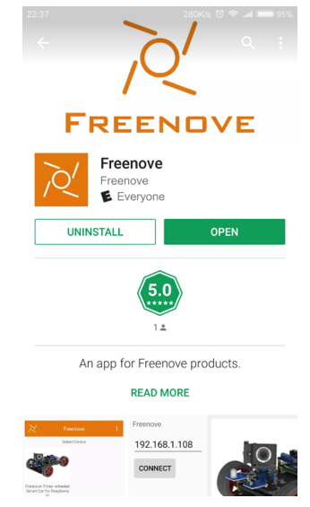
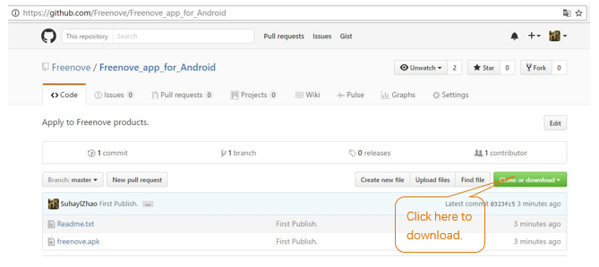
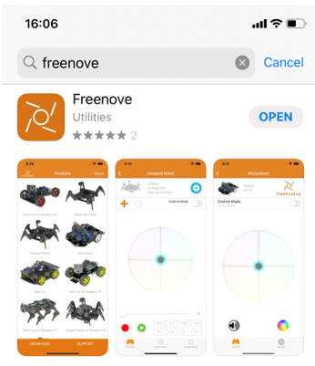

##############################################################################
App
##############################################################################

If you have any concerns, please feel free to contact us at support@freenove.com

We design an Android app for Rover, which you will use in future projects. Please install it as follows. 

Install Freenove Android app
****************************************

We have provided three ways to install the app, you can choose any one. 

Method 1
=========================

Use Google play to search "freenove", and then download and install it.

Method 2
===========================

Visit https://github.com/Freenove/Freenove_app_for_Android, download the files in this library, and install freenove.apk to your Android phone manually. 

Install iPhone iOS app
******************************

Search freenove in App Store and install it.

If you want to learn to control the car step by step, just follow chapter 1 and the following chapters. 

