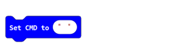
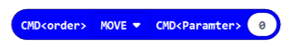

##############################################################################
Appendix 
##############################################################################

The appendix section introduces the role of each block in Rover Extension.

Rover Extension divides all blocks into four groups according to their functions: [LED, Motors, Sensors, Commands].

LEDs
*****************************

.. list-table:: 
   :width: 100%
   :align: center
   :header-rows: 1

   * -  Block
     -  Function

   * -  |Appendix00|
     -  Set the brightness of all RGB LEDs on the Rover.

   * -  |Appendix01|
     -  Set specific RGB LED to a specific color.

   * -  |Appendix02|
     -  Set all RGB LED to a specific color.

   * -  |Appendix03|
     -  Color palette provides 16 kinds of colors.

   * -  |Appendix04|
     -  The HSL color picking model returns the RGB color value.

   * -  |Appendix05|
     -  RGB LED combination selection list.

   * -  |Appendix06|
     -  Common color list provides 10 kinds of colors
  
   * -  |Appendix07|
     -  The RGB color picking model returns the RGB color value.

.. |Appendix07| image:: ../_static/imgs/Appendix/Appendix07.png

Motors
************************

.. list-table:: 
   :width: 100%
   :align: center
   :header-rows: 1

   * -  Block
     -  Function

   * -  |Appendix08|
     -  Set the two motors at the same speed to make the Rover 
      
        move forward or backward. The positive value is for forward
        
        and the negative value is for backward.

   * -  |Appendix09|
     -  Set the speed of the left and right motors to make the 
      
        Rover move or turn.

   * -  |Appendix10|
     -  Set the speed of only one motor (M1 or M2).

   * -  |Appendix11|
     -  Make two motors stop or brake at the same time.

   * -  |Appendix12|
     -  Make only one motor (M1 or M2) stop or brake.
  

Sensors
*****************************

.. list-table:: 
   :width: 100%
   :align: center
   :header-rows: 1

   * -  Block
     -  Function

   * -  |Appendix13|
     -  Start the ultrasonic ranging module and return the measured 
     
        distance. This block is a time-consuming block. If you use 
        
        this block multiple times in a short time, you need use a 
        
        variable to save the returned distance value.

   * -  |Appendix14|
     -  Returns the value of the line-tracking Sensor.

   * -  |Appendix15|
     -  Returns the value of the light-tracing Sensor.

   * -  |Appendix16|
     -  Returns the battery voltage value.

Commands
***************************

.. list-table:: 
   :width: 100%
   :align: center
   :header-rows: 1

   * -  Block
     -  Function

   * -  |Appendix17|
     -  Set CMD as a string and parse it into CMD<order> and 
      
        CMD<parameters>. And store them in cmd<order>  and 
        
        ArrayList<parameters> accordingly.

   * -  |Appendix18|
     -  Return the parsed command.

   * -  |Appendix19|
     -  Return an array in which parsed parameters are stored.

   * -  |Appendix20|
     -  Returns the number of parsed parameters.

   * -  |Appendix21|
     -  Determine whether CMD < order > is the currently 
      
        specified command.

   * -  |Appendix22|
     -  Gets the specified parameter in the parameter array.

   * -  |Appendix27|
     -  Combine a specified command with a specified parameter. 
      
        It is used when sending a command.

   * -  |Appendix23|
     -  Set a variable to represent the mode of Rover.

   * -  |Appendix24|
     -  Judge if the Rover mode variable is the specified mode.

   * -  |Appendix25|
     -  Command/action list.
  
   * -  |Appendix26|
     -  Rover mode list.

