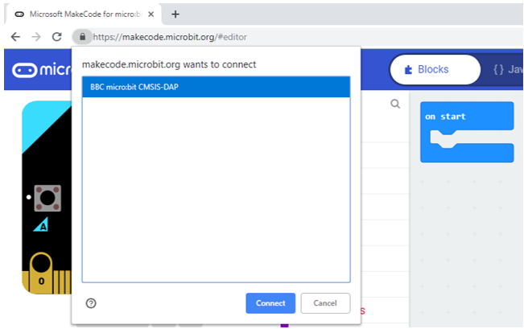

##############################################################################
Code & Programming
##############################################################################

If you have any concerns, please feel free to contact us at support@freenove.com

Quick Start
***********************************

This section describes how to write programs for micro:bit and how to download them to micro:bit. There are very detailed tutorials on the official website. You can refer to: Https://microbit.org/guide/quick/.

Step 1: Connecting Micro:bit
====================================

Connect the micro:bit to your computer via a micro USB cable. Macs, PCs, Chromebooks and Linux systems (including Raspberry Pi) are all supported. 

It comes with an interesting application, give it a try!

Step 2: Create your Program
====================================

Visit https://makecode.microbit.org/. Then click "New Project" and start programming.

If your computer has Windows 10 operating system, you can also use Windows 10 App for programming, which is exactly the same as programming on browsers. Get windows 10 App(Click). 

Write your first micro:bit code. For example, drag and drop some blocks and try your program on the Simulator in the MakeCode Editor, as in the image below that shows how to program a Flashing Heart.

Here is a demo video: https://microbit.org/images/quickstart/makecode-heart.mp4 

.. raw:: html

   <iframe height="500" width="690" src="https://www.youtube.com/embed/2yzT7_QGLLc" frameborder="0" allowfullscreen></iframe>

MakeCode will be further introduced in next section. 

Step 3: Flashing program to your Micro:bit
=================================================

The process of transferring the .HEX file to the BBC micro:bit is called flashing.

If you write program using Windows 10 App, you just need click the "Download" button, then the program will be downloaded directly to micro:bit without any other actions.

If you write program using browser, please follow steps below: 

Click the Download button in the editor. This will download a 'hex' file, which is a compact format of your program that your micro:bit can read. Once the hex file has been downloaded, copy it to your micro:bit just like copying a file to a USB drive. On Windows you can right click and choose "Send to→MICROBIT."

Step 4: Displaying your Program
=====================================

The micro:bit will pause and the yellow LED on the back of the micro:bit will blink while your code is programmed. Once that's finished the code will run automatically!

Note: The micro:bit can only run one program at a time - every time you drag-and-drop a hex file onto the device over USB it will erase the current program and replace it with the new one.

Warning
===============================

:red:`The MICROBIT drive will automatically eject and reconnect each time you program it, but your hex file will be gone. The micro:bit can only receive hex files and won't store anything else!`

MakeCode
===============================

Open web version of `makecode <https://makecode.microbit.org/>`_ or windows 10 app version. 

https://makecode.microbit.org/ 

Click "New Project", the interface of MakeCode editor is as below:

In the code area, there are two fixed blocks "on start" and "forever". 

The code in the "on start" block will be executed only once after power-on or reset, while the code in "forever" block will be executed circularly.

Quick download
****************************

As mentioned earlier, if you use Windows 10 App of MakeCode, you can quickly download the code to micro:bit by clicking the download button. 

Using browser version of MakeCode may require more steps. But if you use **Google Chrome 65+ for platform Android, Chrome OS, Linux, macOS and Windows 10** , you can also download file quickly.

Here we use webUSB feature of Chrome, which allows web pages to access your USB hardware devices. We will complete the connection and pairing of the micro:bit device with the webpage in following steps.

Pair device 
=============================

Connect the computer and micro:bit with a USB cable.

Click the gear menu in the top right corner and then click on "Pair device".

Then continue to click "Pair device" button.

.. image:: ../_static/imgs/App/APP15.png
    :align: center

Select device in popup window and click "Connect" button. If there are no devices in the pop-up window, please refer to following link: https://makecode.microbit.org/device/usb/webusb/troubleshoot 

We have saved the page as a file "Troubleshooting downloads with WebUSB - Microsoft MakeCode.pdf". You can read it directly in the folder of this tutorial. 

And the file "Firmware microbit.pdf" introduces how to update firmware of micro:bit. Its content comes from:

https://microbit.org/guide/firmware/ 

After the connection succeeds, click the Download button and the program will be downloaded directly to Micro: bit.

Extension for MakeCode
*********************************

In order to use Rover more easily, we make a MakeCode Extension for Rover.

.. _extension:

Add Rover Extension
================================

You can add Rover Extension with the following method.

Open MakeCode, click gear icon(settings) Extensions.

Enter this link in the search box: 

https://github.com/Freenove/Makecode-Extension-Rover 

Then click search. 

Click the searching result Rover to download and install it. The process may take a few seconds.

Before clicking search, you can see some extended libraries on the page, including Bluetooth, Servo, neopixel, etc., which can be added by simply clicking on them.

After the installation is completed, you can find Rover extension library on the left.

.. note:: 

    Extension library added to a project is only available for the particular project, and will not appear in other projects. That is to say, if you want to use this extension library in a new project, you need to add it again

Update or Delete Rover Extension
===========================================

If you need to update or delete Rover extension, please follow the instructions below.

Click the " **JavaScript** " button to switch to text code.

Then click on Explorer on the left.

Find Rover in the extended list.

Click on the trash can icon to delete Rover extension.

Click on the refresh icon to update Rover extension.

Resource and code
**********************************

Resource and code of this kit can be viewed and downloaded via the links below:

View: https://github.com/Freenove/Freenove_Micro_Rover 

Download: https://github.com/Freenove/Freenove_Micro_Rover/archive/master.zip 

After downloading and unzipping, a file named Freenove_Micro_Rover or Freenove_Micro_Rover-master, is generated. You can place it anywhere on your computer disk. Enter the folder, then the following contents will be displayed.

This directory is called "root directory", which is represented by "../". And all the relative paths of the future resources in this tutorial start with this directory.

In most project directories, there are two files, xxx.hex, xxx.mp4. Their contents are shown in the following table:

+-----------+-----------------------------------------------------------------+
| File name | Content                                                         |
+-----------+-----------------------------------------------------------------+
| xxx.hex   | Project files for code, containing code and extension Libraries |
+-----------+-----------------------------------------------------------------+
| xxx.mp4   | Demo Video of Code Running on Rover                             |
+-----------+-----------------------------------------------------------------+

.. _import:

Import Code
****************************

We provide hex file (project files) for each project. Hex file contains all the contents of the project and can be imported directly. You can also complete the code of project manually. If you choose to complete the code by dragging code block, you may need add necessary extensions. (How to add extension?)

:green:`As for simple projects, it is recommended to complete the project by dragging code block.`

:green:`for complicated projects, it is recommended to complete the project by importing Hex code file.`

Next, we will take "Heartbeat" project as an example to introduce how to load code.

Open web version of `makecode <https://makecode.microbit.org/>`_ or windows 10 app version.

Click "Import" button on the right side of HOME page.

In the pop-up dialog box, click "Import File".

Select file"../Projects/00.1_Heartbeat/microbit-Heartbeat.hex". Then click "Go ahead!"

A few seconds later, the project is loaded successfully.

