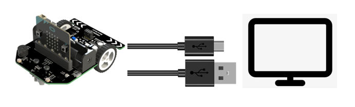
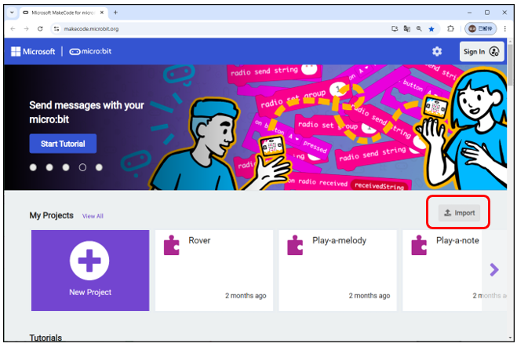
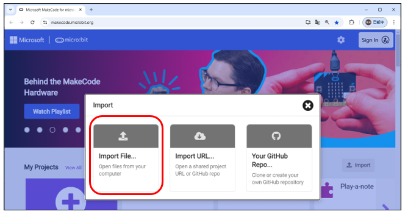
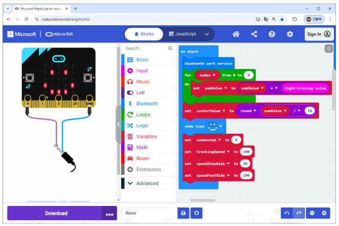
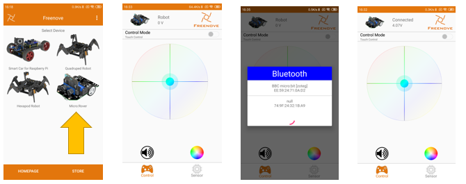

##############################################################################
How to play
##############################################################################

:red:`You can refer to this video:` https://youtu.be/Iu6l6zvQI_U

.. raw:: html

   <iframe height="500" width="690" src="https://www.youtube.com/embed/Iu6l6zvQI_U" frameborder="0" allowfullscreen></iframe>

1 Connect micro:bit with your computer.
**************************************************

2 Upload the code.
**************************************************

Please use the browser, visit the website: https://makecode.microbit.org/

Click Import. Then select Import File...

Go to **Freenove_Micro_Rover\\Projects\\07.1_Rover** and select the hex file based on the version on your microbit. Take **microbit-Rover-for-v2.hex** as an example.

Connect the microbit to your PC and click Download. Wait for the code to download.

3 Connect app
**************************************************

Open Freenove android app. **Click on Micro:Rover.** Then **click Rover icon** in the upper left corner to search Bluetooth device. Then **click your micro:bit in the search list** to connect. After the connection is successful, "Connected" is showed in the status bar above. In this process, there may be a pop-up window asking for permission to obtain location. Click OK, otherwise Bluetooth will not be searched.

